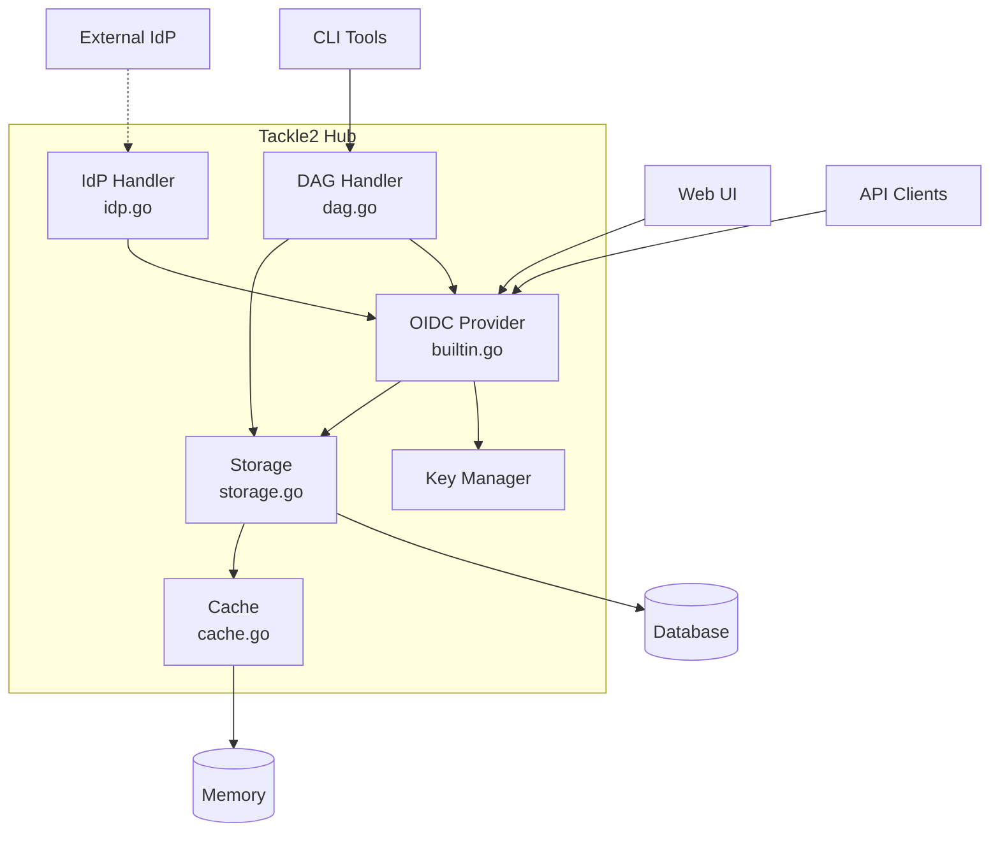
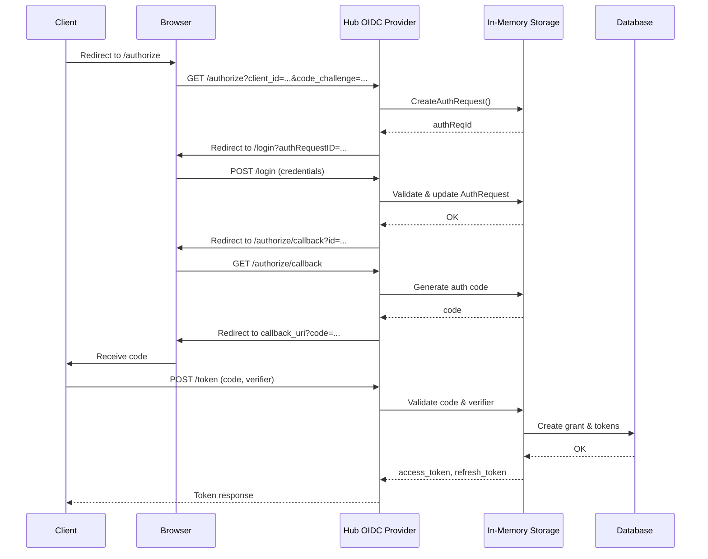
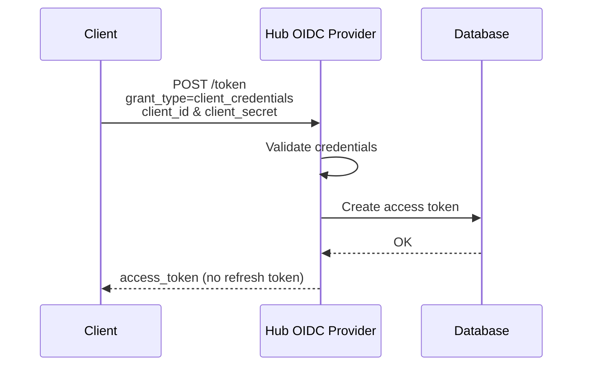
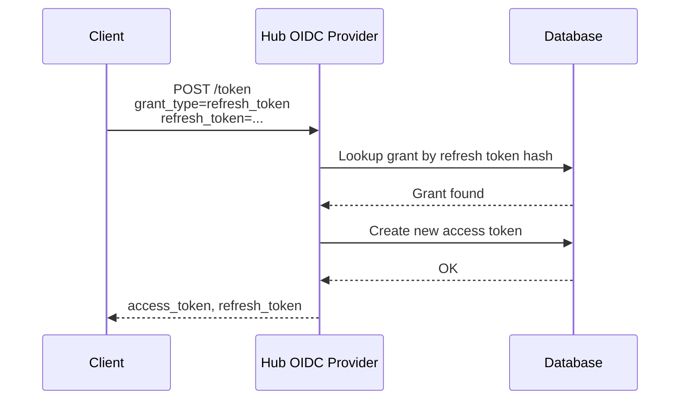
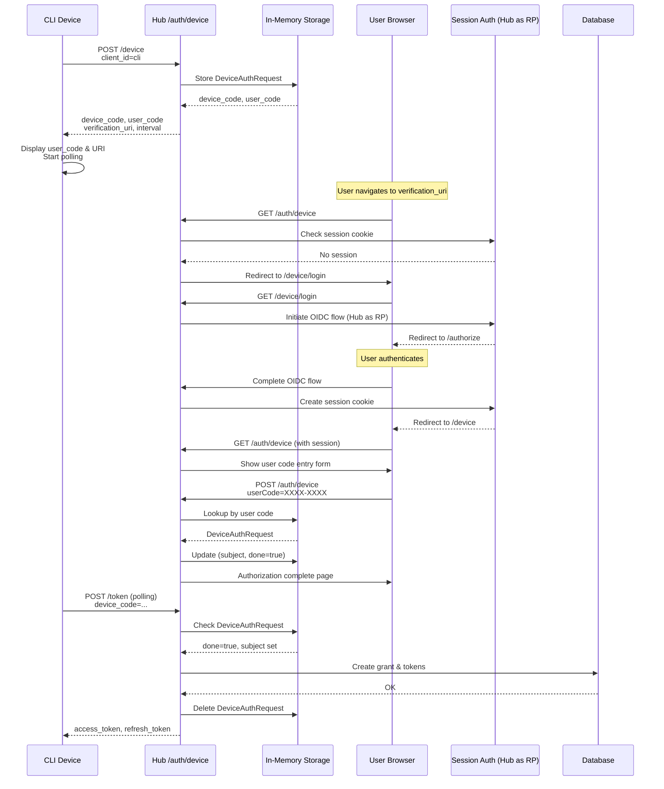
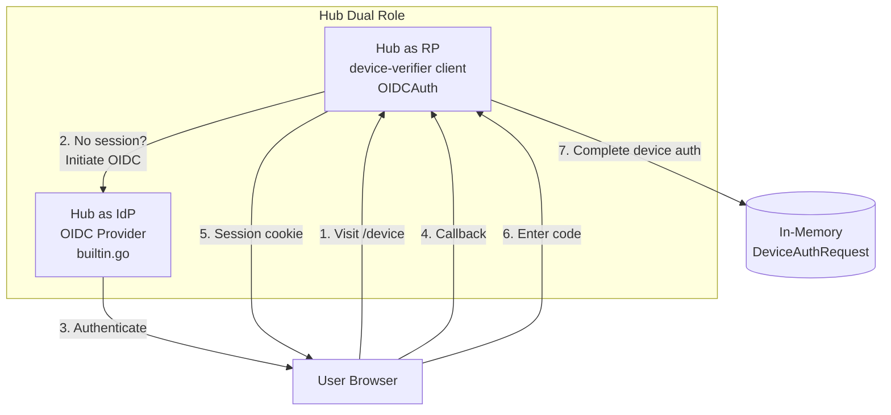
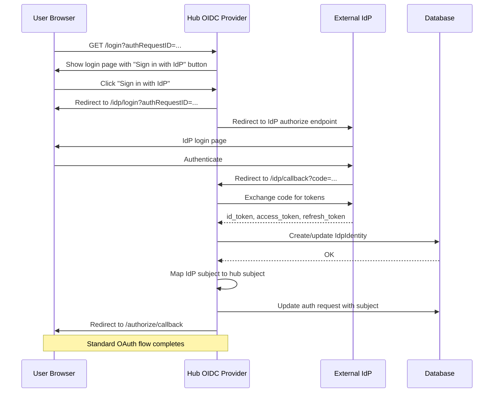
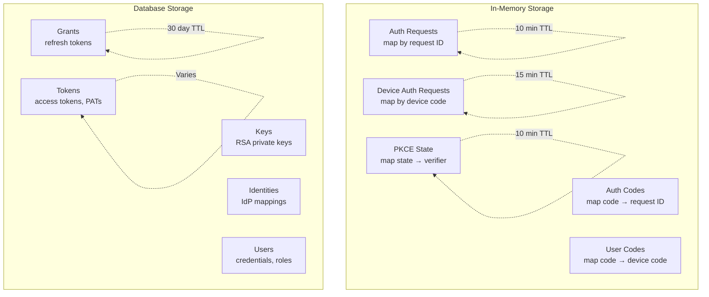

# Tackle2 Hub Authentication

This document describes the authentication and authorization system for Tackle2 Hub.

## Table of Contents

- [Architecture Overview](#architecture-overview)
- [Authentication Methods](#authentication-methods)
- [OIDC Flows](#oidc-flows)
- [Device Authorization Grant](#device-authorization-grant)
- [IdP Federation](#idp-federation)
- [Storage Architecture](#storage-architecture)
- [Token Types](#token-types)
- [Key Management](#key-management)
- [Session Management](#session-management)
- [Web UI Pages](#web-ui-pages)
- [API Client Integration](#api-client-integration)
- [Role Permissions](#role-permissions)

---

## Architecture Overview

Tackle2 Hub provides a **built-in OIDC (OpenID Connect) provider** that implements OAuth 2.0 and OIDC standards. The authentication system supports multiple flows and can optionally federate to an external identity provider.



### Components

- **Builtin Provider** (`builtin.go`) - Core OIDC provider using [zitadel/oidc](https://github.com/zitadel/oidc)
- **Storage** (`storage.go`) - Implements OIDC storage interface, manages auth requests and tokens
- **Cache** (`cache.go`) - In-memory cache for users, roles, identities, and tokens
- **DAG Handler** (`dag.go`) - Device Authorization Grant flow (RFC 8628)
- **IdP Handler** (`idp.go`) - External OIDC provider federation
- **Key Manager** - RSA key generation and JWT signing

### Deployment Topologies

The issuer URL varies by deployment:

- **Route deployment** (OpenShift/Kubernetes): `/auth` path (web-app proxy routes to hub `/oidc`)
- **Direct hub access**: `/oidc` path

---

## Authentication Methods

Tackle2 Hub supports four authentication methods:

### 1. OIDC Tokens (Primary)
OAuth 2.0 access tokens issued by the built-in provider or external IdP. Used by web UI and API clients.

### 2. Basic Authentication
Username/password authentication for local users. Credentials validated against hashed passwords in the database.

### 3. Personal Access Tokens (PATs)
Long-lived API keys created by users for scripting and automation. Managed via `/auth/token` endpoint.

### 4. Task API Keys
Short-lived tokens automatically generated for task execution. Scoped to specific task permissions.

---

## OIDC Flows

### Authorization Code Flow with PKCE

Standard OAuth 2.0 flow for web applications:



**Key points:**
- Auth requests stored **in-memory** (10 minute lifetime)
- PKCE required (code_challenge/code_verifier)
- Grants and tokens persisted to **database**
- Auth request deleted after code exchange

### Client Credentials Flow

For service-to-service authentication:



**Key points:**
- No user context required
- Direct token issuance
- No refresh token (re-authenticate for new token)

### Refresh Token Flow

Extends session without re-authentication:



**Key points:**
- Refresh tokens stored as hashed digests
- New access token issued
- Refresh token optionally rotated
- 30-day default lifetime

---

## Device Authorization Grant

Implements **RFC 8628** for devices with limited input capabilities (CLI tools, scripts).

### Flow Overview



### In-Memory Device Authorization State

Device authorization requests are stored **in-memory** in the hub:

```go
type DeviceAuthRequest struct {
    deviceCode string
    userCode   string      // XXXX-XXXX format
    clientId   string
    subject    string      // Set when user authorizes
    scopes     []string
    issued     time.Time
    expiration time.Time   // Default: 15 minutes
    done       bool        // Authorization complete
    denied     bool        // User denied
    authTime   time.Time   // When user authorized
}
```

**Storage characteristics:**
- Keyed by device code for polling lookups
- Secondary index by user code for verification page
- Automatic cleanup: expired requests removed on each new authorization
- Not persisted to database
- **Hub restart clears all pending device authorizations**

**Memory management:**
```go
// Cleanup expired requests
now := time.Now()
for code, req := range r.devAuthReqs {
    if now.After(req.expiration) {
        delete(r.devAuthReqs, code)
        delete(r.devAuthByCode, req.userCode)
    }
}
```

### Session-Based Authentication for Device Verification

The device verification page requires user authentication but cannot use the standard login form (which is tied to authorization requests). To solve this, **the hub acts as an OIDC Relying Party (RP) to itself**:



**Flow steps:**

1. **User visits verification page** (`/auth/device`)
2. **Session check**: Cookie-based session authentication checks for existing session
3. **No session**: Redirect to `/auth/device/login` which initiates OIDC flow
4. **Hub as RP**: The device verifier client authenticates against the hub's own OIDC provider
5. **PKCE flow**: Uses PKCE for security (server-side state storage, not cookies)
6. **Callback**: `/auth/device/callback` exchanges code for tokens
7. **Session established**: Subject stored in encrypted cookie
8. **Return to device page**: User can now enter device code
9. **Device authorization lookup**: User code maps to in-memory device auth request
10. **Complete authorization**: Device auth request updated with user subject and completion flag

This approach allows the device verification flow to leverage the hub's existing authentication mechanisms (including IdP federation) without coupling it to the OAuth authorization request flow.

### Device Verification Page

The verification page (`/auth/device`) provides:
- Modern gradient UI matching hub design
- User code input with auto-uppercase and monospace formatting
- Automatic OIDC authentication redirect for unauthenticated users
- Cookie-based session persistence across requests
- Lookup of in-memory device authorization by user code
- Success confirmation page after authorization

### Implementation Details

- User codes: 8 characters, format `XXXX-XXXX`, no vowels (avoids accidental words)
- Default lifetime: 15 minutes
- Poll interval: 5 seconds
- Dedicated verifier client (`device-verifier`) handles callback flow
- PKCE state cleanup: Expired states (>10 minutes) automatically pruned
- **Device auth state**: In-memory only, automatic expiration cleanup
- **Hub restart impact**: All pending device authorizations are lost (users must restart)

---

## IdP Federation

Optionally delegate authentication to an external OIDC provider (e.g., Keycloak, Okta, Azure AD).



### Configuration

```yaml
auth:
  idp:
    enabled: true
    issuer: "https://idp.example.com/realms/tackle"
    clientId: "tackle-hub"
    clientSecret: "<secret>"
    redirectURI: "https://hub/auth/idp/callback"
    scopes:
      - openid
      - profile
      - email
    name: "Corporate SSO"
```

### Identity Management

- **IdpIdentity** records store external user mappings
- Token refresh automatically updates identity attributes
- Identity expiration triggers re-authentication
- Supports multiple IdP users mapping to hub roles

---

## Storage Architecture



### In-Memory Storage

Authorization state is stored **in-memory** for performance and simplicity:

#### Auth Requests (Authorization Code Flow)
```go
authReqs      map[string]*AuthRequest  // Keyed by request ID
authByCode    map[string]string        // Maps auth code to request ID
```

- Created during authorization request
- Lifetime: 10 minutes
- Deleted after code exchange
- Not persisted across hub restarts

#### Device Authorization Requests
```go
devAuthReqs   map[string]*DeviceAuthRequest  // Keyed by device code
devAuthByCode map[string]string              // Maps user code to device code
```

- Created during device authorization initiation
- Lifetime: 15 minutes (configurable)
- Automatic cleanup of expired requests on each new request
- Not persisted across hub restarts
- Polling continues until expiration or completion

#### PKCE State (Device Verification Sessions)
```go
pkceState map[string]*PKCEState  // Keyed by OAuth state parameter
```

- Used when hub acts as RP to itself for device verification
- Stores code verifier for PKCE flow
- Lifetime: 10 minutes
- Automatic cleanup on each new state creation
- Server-side storage (not cookies) to avoid domain conflicts

**Implications:**
- Hub restart during active flows requires users to restart authorization
- No database overhead for transient authorization state
- Automatic memory cleanup through expiration
- Thread-safe with mutex protection

### Database Storage

Long-lived authentication artifacts are stored in the database:

#### Grants
- Refresh tokens (hashed)
- Authorization codes
- Client associations
- Expiration: 30 days (configurable)

#### Tokens
- Personal Access Tokens (PATs)
- Task API keys
- Access tokens (for tracking/revocation)
- Expiration: varies by type

#### Keys
- RSA private keys for JWT signing
- Persisted for consistency across restarts

#### Identities
- IdP identity mappings
- User credentials (hashed passwords)
- Role assignments

**Why this split?**
- Authorization state is transient (seconds to minutes)
- Grants and tokens are long-lived (hours to days)
- Database persistence ensures tokens survive hub restarts
- In-memory provides better performance for high-frequency operations

---

## Token Types

### JWT Access Tokens

Short-lived tokens (default 24 hours) with embedded claims:

```json
{
  "sub": "user@example.com",
  "scope": "openid applications:get applications:post ...",
  "roles": ["tackle-admin"],
  "exp": 1234567890,
  "iss": "https://hub/oidc"
}
```

Signed with RSA256 using hub's private key.

### Refresh Tokens

Long-lived opaque tokens (default 30 days) stored in database:
- Used to obtain new access tokens
- Can be revoked independently
- Support token rotation

### Personal Access Tokens (PATs)

User-created API keys:
- Configurable lifespan (default 24 hours, max defined by admin)
- Stored as hashed digest
- Scoped to creating user's permissions
- Managed via `/auth/token` CRUD endpoints

### Task API Keys

Automatically generated for addon task execution:
- Lifespan tied to task execution
- Scoped to task-specific permissions
- Automatically cleaned up when task completes

---

## Key Management

### RSA Key Generation

On first startup, hub generates:
- 2048-bit RSA key pair
- Stored in database (`keys` table)
- Key ID (kid) included in JWT header

### JWKS Endpoint

Public keys published at `/.well-known/jwks.json`:

```json
{
  "keys": [
    {
      "kty": "RSA",
      "use": "sig",
      "kid": "<key-id>",
      "n": "<modulus>",
      "e": "AQAB"
    }
  ]
}
```

### Key Rotation

Currently manual - future enhancement for automatic rotation.

---

## Session Management

### Cookie-Based Sessions

The device authorization flow uses **encrypted, HTTP-only cookies** for session management:

```go
// Session cookie configuration
cookieHandler := httphelper.NewCookieHandler(
    hashKey,      // SHA256 hash key for HMAC
    encryptKey,   // AES-256 encryption key
    httphelper.WithUnsecure(),                    // Allow HTTP for local dev
    httphelper.WithSameSite(http.SameSiteLaxMode), // CSRF protection
)
```

### Key Derivation

Cookie encryption keys are derived from the hub's API key secret:

```go
hashKey := SHA256(secret + "-hash")
encryptKey := SHA256(secret + "-encrypt")
```

This ensures:
- Keys rotate when hub secret changes
- Same keys across hub instances (stateless)
- Strong cryptographic keys without additional configuration

### Hub as OIDC Relying Party

The device verification page acts as an **OIDC Relying Party to the hub itself**:

| Role | Component | Purpose |
|------|-----------|---------|
| **IdP** | Hub OIDC provider (`builtin.go`) | Issues tokens, authenticates users |
| **RP** | Device verifier client (`OIDCAuth` in `dag.go`) | Consumes tokens, validates sessions |

This dual role allows:
- Device verification to use hub's authentication (local or federated)
- No duplicate login UI code
- Consistent authentication flow across all entry points
- Session isolation between web UI and device verification

### PKCE State Storage

Unlike standard OIDC flows that can use cookies, the device flow uses **server-side PKCE state storage**:

```go
type PKCEState struct {
    verifier string
    created  time.Time
}
```

Stored in memory (map) because:
- Hub acts as both IdP and RP, causing cookie domain conflicts
- State lifetime is short (one-time use)
- Automatic cleanup of expired states

### Session Cookie Contents

The session cookie stores only the OIDC subject (user identifier):

```go
// Set cookie after OIDC callback
cookieHandler.SetCookie(writer, "oidc_subject", subject)

// Check cookie on protected routes
subject, err := cookieHandler.CheckCookie(request, "oidc_subject")
```

The subject is then used to:
- Associate device authorization with authenticated user
- Populate device authorization state with user identity
- Complete device code verification

### Session Security

- **HTTP-only**: Not accessible via JavaScript (XSS protection)
- **SameSite=Lax**: CSRF protection
- **Encrypted**: AES-GCM encryption using derived keys
- **HMAC signed**: Prevents tampering
- **No session persistence**: Sessions lost on hub restart (acceptable for short-lived device verification)

---

## Web UI Pages

All authentication pages use consistent modern styling:

### Login Page (`/auth/login`)

- Modern gradient design (purple)
- User ID and password fields
- Optional "Sign in with <IdP>" button when federation enabled
- Mobile responsive

### Device Authorization Page (`/auth/device`)

- User code entry (8 characters, `XXXX-XXXX` format)
- Monospace input with auto-uppercase
- Redirects to OIDC login if not authenticated
- Validates code and completes device authorization

### Success Page (`/auth/device/callback`)

- Checkmark icon confirmation
- "Authorization Complete" message
- Instructs user to return to device

### Common Styling

All pages use:
- System font stack (`-apple-system, BlinkMacSystemFont, "Segoe UI", Roboto, ...`)
- Purple gradient background (`#667eea` to `#764ba2`)
- White card with shadow and rounded corners
- Focus effects on inputs (border color: `#667eea`)
- Hover animations on buttons (transform, box-shadow)
- Font sizes: h1=20px, body=13px, inputs=14px, buttons=15px

---

## API Client Integration

### Binding Package (`shared/binding/auth`)

Provides `Bearer` authenticator for API clients:

```go
import "github.com/konveyor/tackle2-hub/shared/binding/auth"

// Create bearer authenticator
bearer, err := auth.NewBearer(issuerURL, "cli")
if err != nil {
    panic(err)
}

// Perform device authorization flow
err = bearer.DeviceLogin(context.Background())
if err != nil {
    panic(err)
}

// Use with API client
richClient := binding.New(hubURL)
richClient.Client.Use(bearer)

// Bearer automatically includes token in requests
apps, err := richClient.Application.List()
```

### Token Management

```go
// Get current access token
token := bearer.Token()

// Use existing token (e.g., PAT)
bearer.Use(patToken)

// Token automatically refreshed when expired
```

### Example CLI Tool

See `hack/cmd/login/main.go` for a complete example CLI that:
- Performs device authorization flow
- Obtains PAT for scripting
- Tests authentication
- Supports route vs direct deployment scenarios

**Usage:**
```bash
# Using route deployment
./login -r https://tackle.example.com

# Using direct hub access
./login -u http://localhost:8080

# Override issuer URL
./login -u http://localhost:8080 -i http://localhost:8080/oidc

# Use existing bearer token
./login -b <token>

# Basic auth (non-federated users)
./login -userid admin -password password
```

---

## Role Permissions

This section lists what each role may do.  
Verb meanings (CRUD mapping):

- **get** → **Read**
- **post** → **Create**
- **put** / **patch** → **Update**
- **delete** → **Delete**

---

## 🛡 Role: **tackle-admin**
Full administrative access to nearly all resources — can create, read, update, and delete most entities.

| Resource                  | Create | Read | Update | Delete |
|---------------------------|--------|------|--------|--------|
| addons                    | ✅ | ✅ | ✅ | ✅ |
| adoptionplans             | ✅ | ❌ | ❌ | ❌ |
| applications              | ✅ | ✅ | ✅ | ✅ |
| applications.facts        | ✅ | ✅ | ✅ | ✅ |
| applications.tags         | ✅ | ✅ | ✅ | ✅ |
| applications.bucket       | ✅ | ✅ | ✅ | ✅ |
| applications.analyses     | ✅ | ✅ | ✅ | ✅ |
| applications.manifests    | ✅ | ✅ | ❌ | ❌ |
| applications.stakeholders | ❌ | ❌ | ✅ | ❌ |
| applications.assessments  | ✅ | ✅ | ❌ | ❌ |
| assessments               | ✅ | ✅ | ✅ | ✅ |
| businessservices          | ✅ | ✅ | ✅ | ✅ |
| dependencies              | ✅ | ✅ | ✅ | ✅ |
| generators                | ✅ | ✅ | ✅ | ✅ |
| identities                | ✅ | ✅ | ✅ | ✅ |
| imports                   | ✅ | ✅ | ✅ | ✅ |
| jobfunctions              | ✅ | ✅ | ✅ | ✅ |
| kai                       | ✅ | ✅ | ❌ | ❌ |
| manifests                 | ✅ | ✅ | ✅ | ✅ |
| migrationwaves            | ✅ | ✅ | ✅ | ✅ |
| platforms                 | ✅ | ✅ | ✅ | ✅ |
| proxies                   | ✅ | ✅ | ✅ | ✅ |
| reviews                   | ✅ | ✅ | ✅ | ✅ |
| schemas                   | ✅ | ✅ | ✅ | ✅ |
| settings                  | ✅ | ✅ | ✅ | ✅ |
| stakeholdergroups         | ✅ | ✅ | ✅ | ✅ |
| stakeholders              | ✅ | ✅ | ✅ | ✅ |
| tags                      | ✅ | ✅ | ✅ | ✅ |
| tagcategories             | ✅ | ✅ | ✅ | ✅ |
| tasks                     | ✅ | ✅ | ✅ | ✅ |
| tasks.bucket              | ✅ | ✅ | ✅ | ✅ |
| trackers                  | ✅ | ✅ | ✅ | ✅ |
| tickets                   | ✅ | ✅ | ✅ | ✅ |
| cache                     | ❌ | ✅ | ❌ | ✅ |
| files                     | ✅ | ✅ | ✅ | ✅ |
| buckets                   | ✅ | ✅ | ✅ | ✅ |
| rulesets                  | ✅ | ✅ | ✅ | ✅ |
| targets                   | ✅ | ✅ | ✅ | ✅ |
| analyses                  | ✅ | ✅ | ✅ | ✅ |
| archetypes                | ✅ | ✅ | ✅ | ✅ |
| archetypes.assessments    | ✅ | ✅ | ❌ | ❌ |
| questionnaires            | ✅ | ✅ | ✅ | ✅ |

---

## 🛠 Role: **architect**
Broad create/update/delete rights but restricted on identities, proxies, settings, and trackers.

| Resource                  | Create | Read | Update | Delete |
|---------------------------|--------|------|--------|--------|
| addons                    | ✅ | ✅ | ✅ | ✅ |
| adoptionplans             | ✅ | ❌ | ❌ | ❌ |
| applications              | ✅ | ✅ | ✅ | ✅ |
| applications.facts        | ✅ | ✅ | ✅ | ✅ |
| applications.tags         | ✅ | ✅ | ✅ | ✅ |
| applications.bucket       | ✅ | ✅ | ✅ | ✅ |
| applications.analyses     | ✅ | ✅ | ✅ | ✅ |
| applications.manifests    | ✅ | ✅ | ❌ | ❌ |
| applications.stakeholders | ❌ | ❌ | ✅ | ❌ |
| applications.assessments  | ✅ | ✅ | ❌ | ❌ |
| assessments               | ✅ | ✅ | ✅ | ✅ |
| businessservices          | ✅ | ✅ | ✅ | ✅ |
| dependencies              | ✅ | ✅ | ✅ | ✅ |
| generators                | ✅ | ✅ | ✅ | ✅ |
| identities                | ❌ | ✅ | ❌ | ❌ |
| imports                   | ✅ | ✅ | ✅ | ✅ |
| jobfunctions              | ✅ | ✅ | ✅ | ✅ |
| kai                       | ✅ | ✅ | ❌ | ❌ |
| manifests                 | ✅ | ✅ | ✅ | ✅ |
| migrationwaves            | ✅ | ✅ | ✅ | ✅ |
| platforms                 | ✅ | ✅ | ✅ | ✅ |
| proxies                   | ❌ | ✅ | ❌ | ❌ |
| reviews                   | ✅ | ✅ | ✅ | ✅ |
| schemas                   | ❌ | ✅ | ❌ | ❌ |
| settings                  | ❌ | ✅ | ❌ | ❌ |
| stakeholdergroups         | ✅ | ✅ | ✅ | ✅ |
| stakeholders              | ✅ | ✅ | ✅ | ✅ |
| tags                      | ✅ | ✅ | ✅ | ✅ |
| tagcategories             | ✅ | ✅ | ✅ | ✅ |
| tasks                     | ✅ | ✅ | ✅ | ✅ |
| tasks.bucket              | ✅ | ✅ | ✅ | ✅ |
| trackers                  | ❌ | ✅ | ❌ | ❌ |
| tickets                   | ✅ | ✅ | ✅ | ✅ |
| cache                     | ❌ | ✅ | ❌ | ❌ |
| files                     | ✅ | ✅ | ✅ | ✅ |
| buckets                   | ✅ | ✅ | ✅ | ✅ |
| rulesets                  | ✅ | ✅ | ✅ | ✅ |
| targets                   | ✅ | ✅ | ✅ | ✅ |
| analyses                  | ✅ | ✅ | ✅ | ✅ |
| archetypes                | ✅ | ✅ | ✅ | ✅ |
| archetypes.assessments    | ✅ | ✅ | ❌ | ❌ |
| questionnaires            | ❌ | ✅ | ❌ | ❌ |

---

## 🚚 Role: **migrator**
Mostly read-only, except can fully manage dependencies and tasks.

| Resource                 | Create | Read | Update | Delete |
|--------------------------|--------|------|--------|--------|
| addons                   | ❌ | ✅ | ❌ | ❌ |
| adoptionplans            | ✅ | ❌ | ❌ | ❌ |
| applications             | ❌ | ✅ | ❌ | ❌ |
| applications.facts       | ❌ | ✅ | ❌ | ❌ |
| applications.tags        | ❌ | ✅ | ❌ | ❌ |
| applications.bucket      | ❌ | ✅ | ❌ | ❌ |
| applications.analyses    | ❌ | ✅ | ❌ | ❌ |
| applications.manifests   | ❌ | ✅ | ❌ | ❌ |
| applications.assessments | ❌ | ✅ | ❌ | ❌ |
| assessments              | ❌ | ✅ | ❌ | ❌ |
| businessservices         | ❌ | ✅ | ❌ | ❌ |
| dependencies             | ✅ | ✅ | ✅ | ✅ |
| generators               | ❌ | ✅ | ❌ | ❌ |
| identities               | ❌ | ✅ | ❌ | ❌ |
| imports                  | ❌ | ✅ | ❌ | ❌ |
| jobfunctions             | ❌ | ✅ | ❌ | ❌ |
| kai                      | ✅ | ✅ | ❌ | ❌ |
| manifests                | ❌ | ✅ | ❌ | ❌ |
| migrationwaves           | ❌ | ✅ | ❌ | ❌ |
| platforms                | ❌ | ✅ | ❌ | ❌ |
| proxies                  | ❌ | ✅ | ❌ | ❌ |
| reviews                  | ❌ | ✅ | ❌ | ❌ |
| schemas                  | ❌ | ✅ | ❌ | ❌ |
| settings                 | ❌ | ✅ | ❌ | ❌ |
| stakeholdergroups        | ❌ | ✅ | ❌ | ❌ |
| stakeholders             | ❌ | ✅ | ❌ | ❌ |
| tags                     | ❌ | ✅ | ❌ | ❌ |
| tagcategories            | ❌ | ✅ | ❌ | ❌ |
| tasks                    | ✅ | ✅ | ✅ | ✅ |
| tasks.bucket             | ✅ | ✅ | ✅ | ✅ |
| trackers                 | ❌ | ✅ | ❌ | ❌ |
| tickets                  | ❌ | ✅ | ❌ | ❌ |
| cache                    | ❌ | ✅ | ❌ | ❌ |
| files                    | ❌ | ✅ | ❌ | ❌ |
| buckets                  | ❌ | ✅ | ❌ | ❌ |
| rulesets                 | ❌ | ✅ | ❌ | ❌ |
| targets                  | ❌ | ✅ | ❌ | ❌ |
| analyses                 | ❌ | ✅ | ❌ | ❌ |
| archetypes               | ❌ | ✅ | ❌ | ❌ |
| archetypes.assessments   | ❌ | ✅ | ❌ | ❌ |
| questionnaires           | ❌ | ✅ | ❌ | ❌ |

---

## 📋 Role: **project-manager**
Read-only for most resources, except can update `applications.stakeholders` and fully manage `migrationwaves`.

| Resource                  | Create | Read | Update | Delete |
|---------------------------|--------|------|--------|--------|
| addons                    | ❌ | ✅ | ❌ | ❌ |
| adoptionplans             | ✅ | ❌ | ❌ | ❌ |
| applications              | ❌ | ✅ | ❌ | ❌ |
| applications.facts        | ❌ | ✅ | ❌ | ❌ |
| applications.tags         | ❌ | ✅ | ❌ | ❌ |
| applications.bucket       | ❌ | ✅ | ❌ | ❌ |
| applications.analyses     | ❌ | ✅ | ❌ | ❌ |
| applications.manifests    | ❌ | ✅ | ❌ | ❌ |
| applications.stakeholders | ❌ | ❌ | ✅ | ❌ |
| applications.assessments  | ❌ | ✅ | ❌ | ❌ |
| assessments               | ❌ | ✅ | ❌ | ❌ |
| businessservices          | ❌ | ✅ | ❌ | ❌ |
| dependencies              | ❌ | ✅ | ❌ | ❌ |
| identities                | ❌ | ✅ | ❌ | ❌ |
| generators                | ❌ | ✅ | ❌ | ❌ |
| imports                   | ❌ | ✅ | ❌ | ❌ |
| jobfunctions              | ❌ | ✅ | ❌ | ❌ |
| kai                       | ✅ | ✅ | ❌ | ❌ |
| platforms                 | ❌ | ✅ | ❌ | ❌ |
| proxies                   | ❌ | ✅ | ❌ | ❌ |
| reviews                   | ❌ | ✅ | ❌ | ❌ |
| schemas                   | ❌ | ✅ | ❌ | ❌ |
| settings                  | ❌ | ✅ | ❌ | ❌ |
| stakeholdergroups         | ❌ | ✅ | ❌ | ❌ |
| stakeholders              | ❌ | ✅ | ❌ | ❌ |
| tags                      | ❌ | ✅ | ❌ | ❌ |
| tagcategories             | ❌ | ✅ | ❌ | ❌ |
| tasks                     | ❌ | ✅ | ❌ | ❌ |
| tasks.bucket              | ❌ | ✅ | ❌ | ❌ |
| trackers                  | ❌ | ✅ | ❌ | ❌ |
| tickets                   | ❌ | ✅ | ❌ | ❌ |
| cache                     | ❌ | ✅ | ❌ | ❌ |
| files                     | ❌ | ✅ | ❌ | ❌ |
| buckets                   | ❌ | ✅ | ❌ | ❌ |
| rulesets                  | ❌ | ✅ | ❌ | ❌ |
| migrationwaves            | ✅ | ✅ | ✅ | ✅ |
| targets                   | ❌ | ✅ | ❌ | ❌ |
| analyses                  | ❌ | ✅ | ❌ | ❌ |
| archetypes                | ❌ | ✅ | ❌ | ❌ |
| archetypes.assessments    | ❌ | ✅ | ❌ | ❌ |
| questionnaires            | ❌ | ✅ | ❌ | ❌ |


## Supported Scopes

### Addon resources
- addons:delete
- addons:get
- addons:post
- addons:put

### Adoptionplan resources
- adoptionplans:post

### Analysis resources
- analyses:delete
- analyses:get
- analyses:post
- analyses:put

### Application resources
- applications:delete
- applications:get
- applications:post
- applications:put
- applications.analyses:delete
- applications.analyses:get
- applications.analyses:post
- applications.analyses:put
- applications.assessments:get
- applications.assessments:post
- applications.bucket:delete
- applications.bucket:get
- applications.bucket:post
- applications.bucket:put
- applications.facts:delete
- applications.facts:get
- applications.facts:post
- applications.facts:put
- applications.manifests:get
- applications.manifests:post
- applications.stakeholders:put
- applications.tags:delete
- applications.tags:get
- applications.tags:post
- applications.tags:put

### Archetype resources
- archetypes:delete
- archetypes:get
- archetypes:post
- archetypes:put
- archetypes.assessments:get
- archetypes.assessments:post

### Assessment resources
- assessments:delete
- assessments:get
- assessments:post
- assessments:put

### Bucket resources
- buckets:delete
- buckets:get
- buckets:post
- buckets:put

### Businessservice resources
- businessservices:delete
- businessservices:get
- businessservices:post
- businessservices:put

### Cache resources
- cache:delete
- cache:get

### Dependency resources
- dependencies:delete
- dependencies:get
- dependencies:post
- dependencies:put

### File resources
- files:delete
- files:get
- files:post
- files:put

### Generator resources
- generators:delete
- generators:get
- generators:post
- generators:put

### Identity resources
- identities:delete
- identities:get
- identities:post
- identities:put

### Import resources
- imports:delete
- imports:get
- imports:post
- imports:put

### Jobfunction resources
- jobfunctions:delete
- jobfunctions:get
- jobfunctions:post
- jobfunctions:put

### Kai resources
- kai:get
- kai:post

### Manifest resources
- manifests:delete
- manifests:get
- manifests:post
- manifests:put

### Migrationwave resources
- migrationwaves:delete
- migrationwaves:get
- migrationwaves:post
- migrationwaves:put

### Platform resources
- platforms:delete
- platforms:get
- platforms:post
- platforms:put

### Proxy resources
- proxies:delete
- proxies:get
- proxies:post
- proxies:put

### Questionnaire resources
- questionnaires:delete
- questionnaires:get
- questionnaires:post
- questionnaires:put

### Review resources
- reviews:delete
- reviews:get
- reviews:post
- reviews:put

### Ruleset resources
- rulesets:delete
- rulesets:get
- rulesets:post
- rulesets:put

### Schema resources
- schemas:delete
- schemas:get
- schemas:post
- schemas:put

### Setting resources
- settings:delete
- settings:get
- settings:post
- settings:put

### Stakeholdergroup resources
- stakeholdergroups:delete
- stakeholdergroups:get
- stakeholdergroups:post
- stakeholdergroups:put

### Stakeholder resources
- stakeholders:delete
- stakeholders:get
- stakeholders:post
- stakeholders:put

### Tagcategory resources
- tagcategories:delete
- tagcategories:get
- tagcategories:post
- tagcategories:put

### Tag resources
- tags:delete
- tags:get
- tags:post
- tags:put

### Target resources
- targets:delete
- targets:get
- targets:post
- targets:put

### Task resources
- tasks:delete
- tasks:get
- tasks:patch
- tasks:post
- tasks:put
- tasks.bucket:delete
- tasks.bucket:get
- tasks.bucket:post
- tasks.bucket:put

### Ticket resources
- tickets:delete
- tickets:get
- tickets:post
- tickets:put

### Tracker resources
- trackers:delete
- trackers:get
- trackers:post
- trackers:put
