# Tackle2 Hub Authentication

This document describes the design and architecture of the authentication and authorization system for Tackle2 Hub.

## Table of Contents

- [Architecture Overview](#architecture-overview)
- [Authentication Methods](#authentication-methods)
- [Subject and Identity Resolution](#subject-and-identity-resolution)
- [OIDC Flows](#oidc-flows)
- [Device Authorization Grant](#device-authorization-grant)
- [IdP Federation](#idp-federation)
- [LDAP Authentication](#ldap-authentication)
- [Client Configuration](#client-configuration)
- [Storage Architecture](#storage-architecture)
- [Token Types](#token-types)
- [Key Management](#key-management)
- [Session Management](#session-management)
- [Web UI Pages](#web-ui-pages)
- [API Client Integration](#api-client-integration)
- [RBAC Seeding System](#rbac-seeding-system)
- [Role Permissions](#role-permissions)

---

## Architecture Overview

Tackle2 Hub provides a **built-in OIDC (OpenID Connect) provider** that implements OAuth 2.0 and OIDC standards. The authentication system supports multiple flows and can optionally federate to an external identity provider or LDAP server.

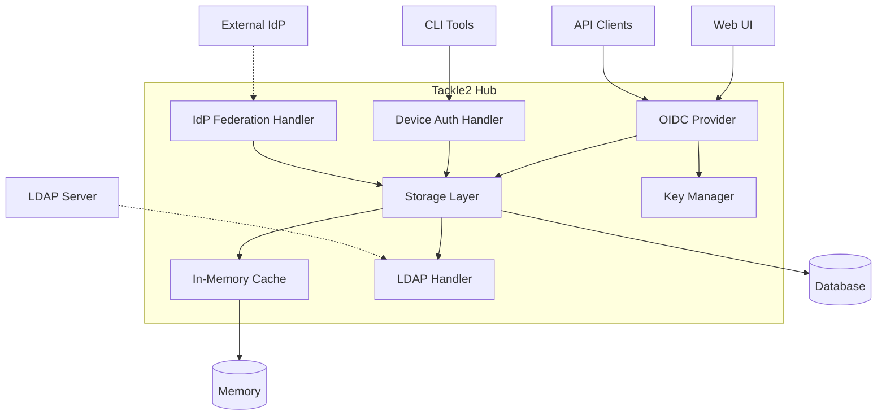

### Components

| Component | Purpose |
|-----------|---------|
| **OIDC Provider** | Core OAuth 2.0 and OIDC provider implementation |
| **Storage Layer** | Manages authorization requests, grants, and tokens |
| **Cache** | In-memory cache for users, roles, identities, and tokens |
| **Device Auth Handler** | RFC 8628 Device Authorization Grant flow |
| **IdP Federation Handler** | Delegates authentication to external OIDC providers |
| **LDAP Handler** | Authenticates users against LDAP/Active Directory |
| **Key Manager** | RSA key generation, rotation, and JWT signing |

### Deployment Topologies

| Deployment | Auth REST API | OIDC Endpoints | Notes |
|------------|---------------|----------------|-------|
| **Direct Hub Access** | `/auth/*` | `/oidc/*` | Non-OIDC resources (users, roles, etc.) at `/auth`, OIDC endpoints at `/oidc` |
| **Kubernetes/OpenShift (with Route)** | `/hub/auth/*` | `/oidc/*` | `/auth` routes to external IdP (e.g., Keycloak), hub resources at `/hub/auth` |

**Note:** In all deployments, OIDC endpoints are at `/oidc/*`. When deployed in a cluster with a route/ingress, `/auth` typically routes to an external IdP, and hub auth resources (users, roles, etc.) are accessed at `/hub/auth/*`.

---

## Authentication Methods

Tackle2 Hub supports four authentication methods:

### 1. OIDC Tokens (Primary)
OAuth 2.0 access tokens issued by the built-in provider. Used by web UI and API clients for standard authentication flows.

### 2. Basic Authentication
Username/password authentication for local users or LDAP users. Credentials validated against:
- Local users: hashed passwords in database
- LDAP users: authentication against LDAP server

### 3. Personal Access Tokens (PATs)
Long-lived API keys created by users for scripting and automation. Managed via `/auth/token` CRUD endpoints.

### 4. Task API Keys
Short-lived tokens automatically generated for addon task execution. Scoped to task-specific permissions and cleaned up when task completes.

---

## Authentication Staleness and Cache Management

Different authentication methods have different staleness characteristics based on their use cases and security requirements.

### Staleness Control Summary

| Authentication Method | Primary Control | Worst Case | Environment Variable | Default |
|----------------------|----------------|------------|---------------------|---------|
| **OAuth Access Tokens** | Token `exp` claim | N/A (stateless) | `OIDC_TOKEN_LIFESPAN` | 5 minutes |
| **Basic Auth (Local Users)** | Cache notifications | 5 minutes | `AUTH_CACHE_LIFESPAN` | 5 minutes |
| **Basic Auth (LDAP)** | Identity expiration | 5 minutes | `LDAP_AUTH_LIFESPAN` | 5 minutes |
| **Personal Access Tokens** | Cache notifications | 5 minutes | `AUTH_CACHE_LIFESPAN` | 5 minutes |
| **OAuth Refresh (LDAP)** | Identity expiration | 5 minutes | `LDAP_AUTH_LIFESPAN` | 5 minutes |

### Cache Architecture

The authentication cache uses a **two-layer strategy** for optimal performance and freshness:

**Primary: Immediate Notifications**
- When users/roles/identities/tokens are modified via the API, the cache is updated **immediately**
- Changes propagate in < 1 second (typical in-memory update time)
- Triggered by: UserSaved, RoleSaved, IdentitySaved, TokenDeleted, etc.
- Ensures near-instant application of changes made through the hub API

**Secondary: Safety-Net Refresh**
- Periodic refresh every `AUTH_CACHE_LIFESPAN` (default: 5 minutes)
- Catches changes made directly in the database (external tools, migrations)
- Ensures eventual consistency even if notifications fail
- Acts as a backstop, not the primary staleness control

From the code comments (`internal/auth/cache/cache.go`):
```go
// Cache Strategy:
//   - Notifications: Saved/Deleted methods immediately update the cache
//   - Safety-net: Periodic refresh.
//   - Password changes, role updates, and other changes are propagated
//     immediately via notifications
```

### Staleness by Authentication Method

#### OAuth Access Tokens (JWT)

**Staleness:** Controlled by JWT `exp` claim (stateless validation)

Clients send bearer tokens on every request. The server validates the JWT signature and checks the `exp` claim against current time. No database or cache lookup required. Permission changes don't apply until token refresh.

**Trade-off:** Performance and scalability vs immediate permission propagation.

#### Basic Authentication - Local Users

**Staleness:** Near-instant via cache notifications (< 1 second typical)

Clients send username/password on every request. The server looks up the user in cache, validates the password hash, and resolves roles/scopes. When users/roles are modified via the API, the cache is updated immediately via notifications (UserSaved, RoleSaved). 

The server creates an ephemeral JWT with `exp` set to `CacheLifespan` for the internal request context, but this JWT is **never sent to the client** - it exists only for the single request. Actual staleness is controlled by cache notifications, not the JWT expiration.

**Fallback:** Up to 5 minutes (cache safety-net refresh) only for direct database modifications.

#### Basic Authentication - LDAP Users  

**Staleness:** Controlled by `LDAP_AUTH_LIFESPAN` (default: 5 minutes)

Clients send username/password on every request. The server checks for a cached LDAP identity. If the identity is cached and not expired, the cached scopes are used. If expired or not cached, the server authenticates against the LDAP server, queries groups, maps groups to roles, and creates/updates the identity with `Expiration = now + LdapAuthLifespan`.

Password validation always goes to LDAP (bind operation). Role mapping changes propagate via cache notifications. The lifespan controls how often group memberships are refreshed from LDAP.

**Trade-off:** LDAP load vs permission freshness.

#### Personal Access Tokens (PAT/API Keys)

**Staleness:** Near-instant for revocation via cache notifications (< 1 second typical)

Clients send bearer tokens (API keys) on every request. The server computes the SHA256 hash and looks up the token in cache. Token revocation propagates immediately via cache notifications (TokenDeleted). User role changes are resolved fresh on every request from the cached user data.

**Fallback:** Up to 5 minutes (cache safety-net refresh) for cache misses.

#### OAuth Refresh with LDAP Identity

**Staleness:** Controlled by `LDAP_AUTH_LIFESPAN` (default: 5 minutes)

When refreshing tokens, if the associated LDAP identity has expired, the server re-authenticates with LDAP using the stored password and fetches fresh group memberships. This enables automatic permission updates without user interaction.

**Trade-off:** LDAP load vs automatic permission sync during token refresh.

### Environment Variables

Complete list of authentication-related environment variables:

| Variable | Type | Default | Description |
|----------|------|---------|-------------|
| `AUTH_ENABLED` | Boolean | `true` | Enable authentication system |
| `AUTH_REQUIRED` | Boolean | `false` | Enforce authentication for all API requests |
| `AUTH_CACHE_LIFESPAN` | Integer (minutes) | `5` | Cache safety-net refresh interval; worst-case staleness for basic auth and PATs |
| `LDAP_AUTH_LIFESPAN` | Integer (minutes) | `5` | LDAP identity cache duration; controls LDAP query frequency |
| `OIDC_TOKEN_LIFESPAN` | Integer (seconds) | `300` | OAuth access token lifespan in seconds (5 minutes) |
| `OIDC_REFRESH_TOKEN_LIFESPAN` | Integer (seconds) | `172800` | OAuth refresh token lifespan in seconds (2 days) |
| `OIDC_KEY_ROTATION` | Integer (days) | `90` | RSA signing key rotation interval in days |
| `APIKEY_SECRET` | String | `tackle` | Secret used for API key generation |
| `APIKEY_LIFESPAN` | Integer (hours) | `87600` | Personal Access Token lifespan in hours (10 years) |

**Note on OIDC Issuer:** The OIDC issuer is now **dynamically determined** from the incoming HTTP request rather than configured via environment variable. The issuer is constructed from the request's scheme, host, and path to `/oidc`. This enables the hub to work seamlessly across different deployment environments (localhost, OpenShift routes, custom domains) without configuration changes.

**Note:** See [shared/settings/README.md](../../shared/settings/README.md) for complete settings documentation.

---

## Subject and Identity Resolution

### Core Concepts

The authentication system uses **Subject** as the central abstraction representing an authenticated entity. A Subject is resolved from one of three sources:

| Source | Description | Use Case |
|--------|-------------|----------|
| **User** | Local hub user with role assignments | Hub-managed authentication |
| **IdpIdentity** | External identity (LDAP or federated OIDC) | LDAP or external IdP authentication |
| **IdpClient** | OAuth2 client for machine-to-machine auth | Client credentials grant flow |

**Key principle**: A Subject is **mutually exclusive** — it references either a User, an IdpIdentity, OR an IdpClient, never more than one.

### Terminology: Login, Name, and ID

The authentication system uses three distinct identifiers for users and identities:

| Field | Type | Purpose | Example | Notes |
|-------|------|---------|---------|-------|
| **ID** | uint | Database primary key | `1`, `42` | Auto-generated, internal use only |
| **Login** | string | Login identifier | `jsmith` | **Unique**, used for authentication, like a "username" or "userid" |
| **Name** | string | Display name | `John Smith` | **Optional**, human-friendly, can be non-unique |

**Why "Login" instead of "Username" or "Userid"?**

The term "Login" was chosen to avoid collision and confusion:
- **"ID" / "UserId"** already refers to the numeric database primary key (`User.ID`)
- **"Name" / "UserName"** refers to the display name (`User.Name`)
- **"Login"** clearly indicates the identifier used for authentication (like `jsmith`)

**Examples:**
- Local user: `Login = "admin"`, `Name = "Administrator"`, `ID = 1`
- LDAP user: `Login = "jsmith"` (from LDAP uid/sAMAccountName), `Name = "John Smith"` (from LDAP cn)
- External IdP: `Login = "jsmith"` (from preferred_username), `Name = "John Smith"` (from name claim)

The `Login` field follows the **GitHub API pattern**, which uses `"login"` for the unique identifier and `"name"` for the display name.

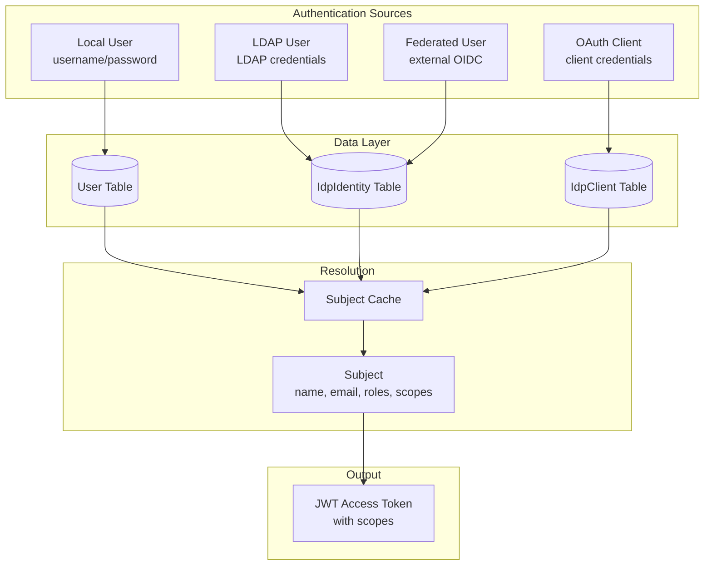

### Subject Abstraction

A Subject contains the following information:

| Attribute | Description |
|-----------|-------------|
| **Key** | Subject identifier (UUID for User/IdpClient, hash/external subject for IdpIdentity) |
| **Email** | User's email address (empty for IdpClient) |
| **Scopes** | Permission scope strings (JSON array, injected into JWT tokens) |
| **Source Reference** | Points to either User, IdpIdentity, or IdpClient record (UserId/IdentityId/ClientId) |

### Subject Derivation

The `Subject` field is the **unique identifier** for an authenticated entity and appears in JWT tokens as the `sub` claim. Different authentication methods derive subjects differently:

| Authentication Method | Subject Format | Example | Derivation |
|----------------------|----------------|---------|------------|
| **Local User** | UUID v4 | `550e8400-e29b-41d4-a716-446655440000` | `uuid.New().String()` via BeforeCreate hook |
| **OIDC Client (Client Credentials)** | UUID v4 | `d3e8f5a6-7b8c-9d0e-1f2a-3b4c5d6e7f8a` | `uuid.New().String()` via BeforeCreate hook |
| **OIDC (External IdP)** | IdP subject | `f8e3a2b1-4c5d-6e7f-8a9b-0c1d2e3f4a5b` | External IdP's `sub` claim (as-is) |
| **LDAP** | HMAC-SHA256 hash | `dsLflKrXRBgaZC3u8XNHJS8UskJ19GM5AWIZ8nBheFA=` | `secret.Hash(login)` |

**Design principles:**
- **Opaque**: Subjects don't reveal PII (username, email, DN) in JWT tokens
- **Stable**: Same user always produces same subject across authentications
- **Unique**: No collisions between different users or authentication methods
- **Globally Unique**: Hub passphrase ensures LDAP hashes are unique to this hub instance

**Why these approaches?**

*Local User (UUID):*
- Random UUID provides natural uniqueness and opacity
- Stable across user's lifetime
- Standard practice for local identity systems
- Generated automatically via GORM BeforeCreate hook

*OIDC Client (UUID):*
- Same benefits as Local User (uniqueness, opacity, stability)
- Consistent with user subject format
- Generated automatically via GORM BeforeCreate hook
- Enables client credentials grant flow for machine-to-machine authentication

*OIDC (Raw IdP subject):*
- External IdP subject is already opaque per OIDC spec (typically a UUID)
- Must preserve exact value for token refresh and IdP correlation
- Already globally unique within the issuer's namespace
- No hashing needed - would break IdP integration

*LDAP (Hash of login):*
- Raw login identifier would leak PII in JWT tokens
- HMAC with hub's secret passphrase ensures:
  - Opacity: Hash conceals actual login identifier
  - Stability: Login doesn't change when user moves OUs in LDAP
  - Uniqueness: Hub passphrase makes hash unique to this hub instance
  - No collision: External IdP cannot generate matching hash (doesn't know passphrase)
- DN hash was rejected because DN changes break identity (OU reorganizations)

**Collision resistance:**

The different formats provide natural separation:
- UUID vs UUID: ~1 in 5.3 × 10^36 probability (negligible)
- LDAP hash vs OIDC subject: Cryptographically infeasible (HMAC with secret passphrase)
- All three use database uniqueness constraint on `Subject` field

### IdpIdentity Model

The IdpIdentity table stores external authentication mappings for **both** LDAP and federated OIDC users:

| Field | Type | Purpose | LDAP Value | OpenID Value |
|-------|------|---------|------------|--------------|
| **Kind** | String | Discriminator | `"ldap"` | `"openid"` |
| **Issuer** | String | Authentication source | LDAP server URL | OIDC issuer URL |
| **Subject** | String (unique) | Opaque identifier | `secret.Hash(login)` | IdP subject claim |
| **Login** | String | Login identifier (username like `jsmith`) | LDAP uid/sAMAccountName | IdP preferred_username |
| **Name** | String | Display name (optional, like `John Smith`) | From LDAP cn (optional) | From IdP name claim (optional) |
| **Email** | String | Email address | From LDAP mail attribute | From IdP email claim |
| **RefreshToken** | String (encrypted) | Refresh credentials | User password | OAuth refresh token |
| **Expiration** | Timestamp | When identity expires | Based on config | From token expiry |
| **Scopes** | JSON Array | Permission scope strings | Mapped from LDAP groups | Extracted from access token |

**Why unified model?**
- Single subject resolution path
- Consistent caching strategy
- Unified token refresh mechanism
- Simplified database schema

### Authentication Pipeline

Authentication attempts multiple methods in sequence until one succeeds:

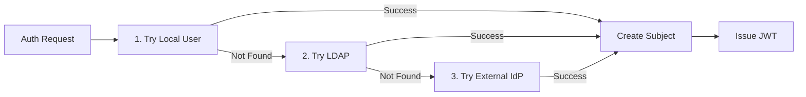

**Pipeline behavior:**
- Each method returns: Success, NotFound, or Error
- NotFound → try next method
- Success → create Subject, issue token
- Error → authentication fails

### Cache-Based Resolution

Subjects are resolved from cache for performance:

**Cache structure:**
- Users indexed by subject (UUID)
- IdpIdentities indexed by subject (login hash for LDAP or external subject for OIDC)
- IdpClients indexed by subject (UUID)
- O(1) lookup by subject identifier
- Auto-refresh when not found or cache expired

**Cache lifecycle:**
1. Subject lookup by identifier
2. If found in cache → return Subject
3. If not found → refresh cache from database
4. Retry lookup
5. If still not found → authentication fails

**Security consideration:**
- User cache **always refreshes** on lookup to prevent stale password usage
- IdpIdentity cache uses standard lifespan to balance security and performance

### Scope Injection

When issuing tokens, permission scopes are injected from the Subject:

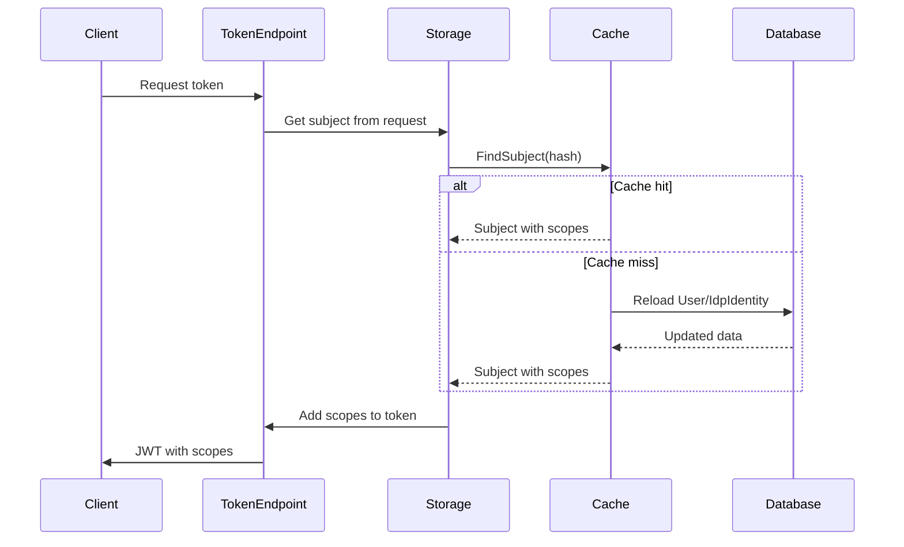

### Identity Refresh Mechanism

IdpIdentities are automatically refreshed when tokens are refreshed:

| Identity Kind | Refresh Behavior |
|---------------|------------------|
| **Local User** | No refresh needed (roles managed in hub) |
| **LDAP** | Re-authenticate with stored password, fetch fresh group memberships |
| **OpenID** | Use OAuth refresh token to get updated claims from external IdP |

**Why refresh on token refresh?**
- Group memberships may change (LDAP)
- Permission scopes may change (external IdP)
- Ensures current permissions in new access token
- Automatic without user re-authentication

### Subject Resolution Examples

**Local User:**
```
1. User authenticates with username/password
2. Lookup User in database by login
3. Verify password hash
4. Subject.Key = User.Subject (UUID)
5. Subject.Scopes = aggregate all scopes from User.Roles (each role's Scopes JSON array)
6. Subject.source = User reference
```

**LDAP User:**
```
1. User authenticates with username/password
2. LDAP server validates credentials, returns DN
3. Fetch group memberships from LDAP
4. Map groups to roles → resolve role scopes (JSON array)
5. Create/update IdpIdentity (Kind=ldap, Subject=hash(login))
6. Subject.Key = hash(login)
7. Subject.Scopes = from IdpIdentity.Scopes (JSON array)
8. Subject.source = IdpIdentity reference
```

**Federated User:**
```
1. OAuth flow completes with external IdP
2. Exchange code for ID token and access token
3. Extract subject, email, scopes from tokens
4. Create/update IdpIdentity (Kind=openid, Subject=IdP subject)
5. Subject.Key = IdP subject claim
6. Subject.Scopes = from IdpIdentity.Scopes (JSON array)
7. Subject.source = IdpIdentity reference
```

**OAuth Client (Client Credentials):**
```
1. Client authenticates with client_id and client_secret
2. Lookup IdpClient in database by client_id
3. Verify client_secret hash
4. Subject.Key = IdpClient.Subject (UUID)
5. Subject.Scopes = IdpClient.Scopes
6. Subject.source = IdpClient reference
7. JWT issued with client scopes (no user context)
```

### Key Design Decisions

**Why hash client secrets?**
- Client secrets are hashed using bcrypt (one-way hash), not encrypted
- Same security model as user passwords
- Authentication validates presented secret against stored hash using constant-time comparison
- Database compromise does not reveal plaintext secrets
- No ability to recover original secret (must regenerate if lost)
- More secure than encryption (which requires protecting encryption keys)

**Why hash LDAP login for subject?**
- Raw login identifier would expose usernames in JWT tokens
- HMAC hash provides stable, opaque identifier
- Same login always produces same subject
- Stable across LDAP OU reorganizations (unlike DN)
- Database uniqueness constraint on subject

**Why store passwords for LDAP users?**
- Token refresh requires re-authentication to get fresh groups
- Alternative: force user to re-login on token expiry
- Password encrypted at ORM level for security
- Enables automatic group membership updates

**Why single IdpIdentity table for LDAP and OpenID?**
- Unified subject resolution
- Consistent caching strategy
- Shared refresh mechanism
- Simpler schema

---

## OIDC Flows

### Authorization Code Flow with PKCE

Standard OAuth 2.0 authorization code flow with PKCE for web applications:

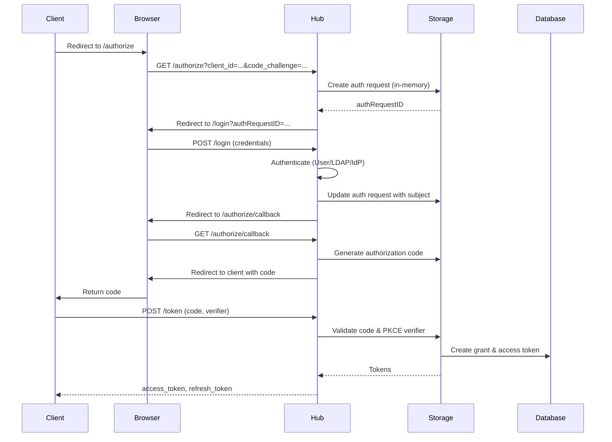

**Key characteristics:**
- Auth requests stored **in-memory** (10 minute lifetime)
- PKCE required for security
- Grants and tokens persisted to **database**
- Auth request deleted after code exchange

### Client Credentials Flow

Service-to-service authentication without user context:

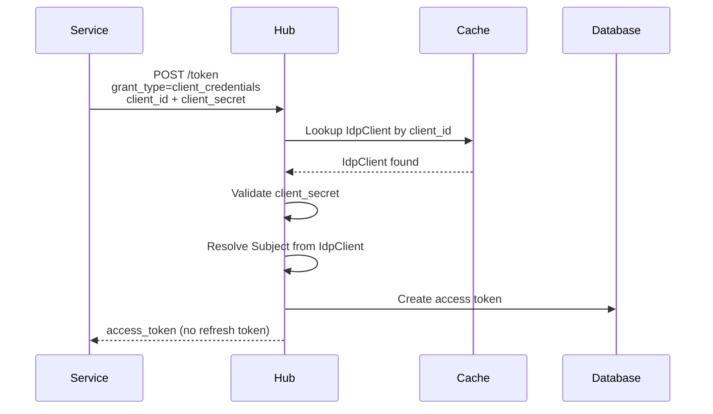

**Characteristics:**
- No user context - client is the subject
- Direct token issuance
- No refresh token (re-authenticate for new token)
- Scoped to client permissions (IdpClient.Scopes)
- Subject resolved from IdpClient.Subject (UUID)
- Cached for performance

### Refresh Token Flow

Extend session without re-authentication:

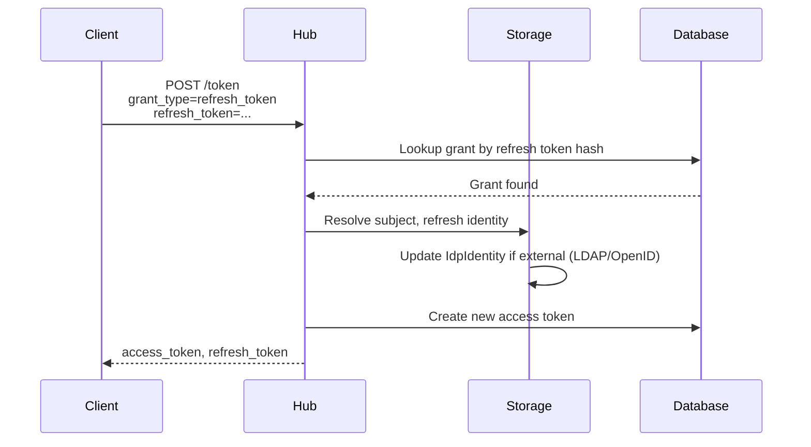

**Characteristics:**
- Refresh tokens stored as SHA256 hashes
- New access token issued with current scopes
- IdpIdentities automatically refreshed (LDAP re-auth, OAuth token refresh)
- 30-day default grant lifetime

---

## Device Authorization Grant

Implements **RFC 8628** for devices with limited input capabilities (CLI tools, scripts).

### Overview

Device authorization allows CLI tools and headless clients to authenticate using a user code entered on a separate device (browser).

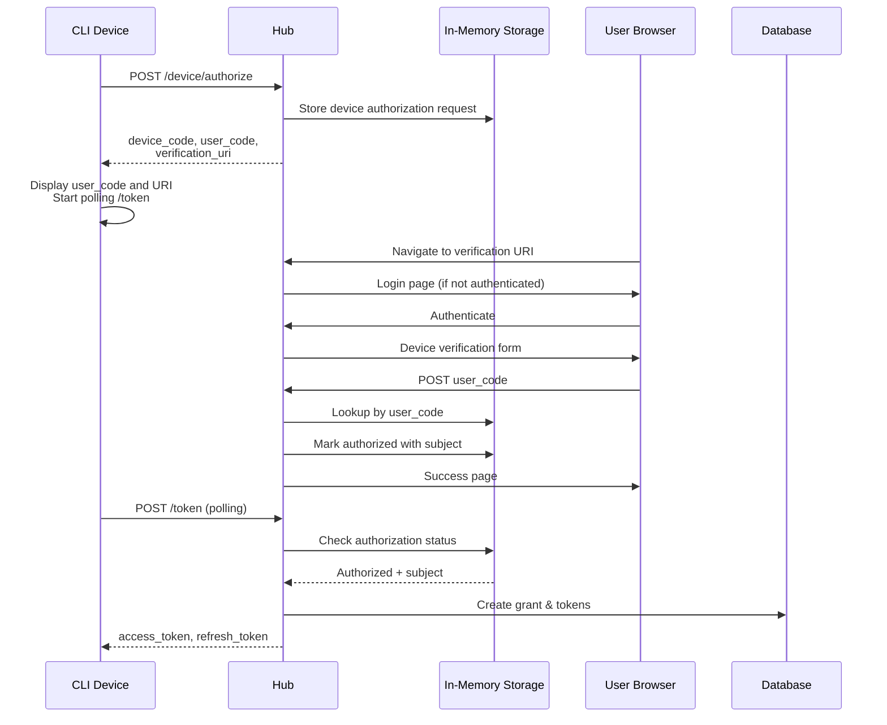

### User Code Format

- **Length**: 8 characters
- **Format**: `XXXX-XXXX` (4-4 with dash)
- **Character set**: No vowels (prevents accidental words)
- **Case**: Case-insensitive, normalized to uppercase

### In-Memory Device State

Device authorization requests are stored in memory:

| Field | Purpose |
|-------|---------|
| **device_code** | Unique code for device polling |
| **user_code** | Code displayed to user for entry |
| **client_id** | OAuth client identifier |
| **subject** | Set when user authorizes device |
| **scopes** | Requested permission scopes |
| **expiration** | Default 15 minutes |
| **done** | Authorization completed flag |
| **denied** | User denied authorization flag |

**Storage characteristics:**
- Not persisted to database
- Automatic cleanup of expired requests
- **Hub restart clears all pending authorizations**

### Session-Based Verification

The device verification page requires authenticated users. The hub **acts as an OIDC Relying Party to itself** to manage verification sessions:

```mermaid
graph TB
    subgraph "Hub Dual Role"
        RP[Hub as Relying Party<br/>device-verifier client]
        IdP[Hub as Identity Provider<br/>OIDC provider]
    end
    
    Browser[User Browser] -->|1. Visit /device| RP
    RP -->|2. Check session| Session{Session?}
    Session -->|No| OIDC[3. Initiate OIDC flow]
    OIDC --> IdP
    IdP -->|4. Authenticate| Browser
    Browser -->|5. Callback| RP
    RP -->|6. Set session cookie| Browser
    Session -->|Yes| Form[7. Show code entry form]
    Form --> Browser
```

**Why this design?**
- Device verification page needs authentication
- Can't use standard login form (tied to OAuth auth requests)
- Hub authenticates against itself using OIDC
- Session isolated from main OAuth flows
- Leverages existing authentication (local/LDAP/federated)

### Implementation Details

| Setting | Value | Notes |
|---------|-------|-------|
| **Default lifetime** | 15 minutes | Configurable |
| **Poll interval** | 5 seconds | Recommended by hub |
| **PKCE** | Required | Server-side state, not cookies |
| **Session storage** | Encrypted cookies | AES-GCM with HMAC |

---

## IdP Federation

Optionally delegate authentication to an external OIDC provider (Keycloak, Okta, Azure AD, etc.). Federated users are stored as **IdpIdentity** records with Kind=`"openid"`.

### Architecture

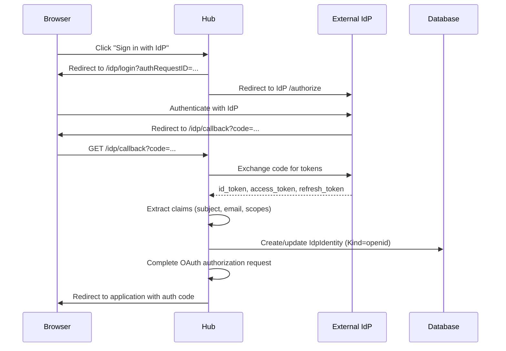

### Configuration

To enable federation to an external OIDC provider, create an `IdentityProvider` Custom Resource:

```yaml
apiVersion: tackle.konveyor.io/v1alpha1
kind: IdentityProvider
metadata:
  name: corporate-sso
  namespace: konveyor-tackle
spec:
  name: "Corporate SSO"
  issuer: "https://idp.example.com/realms/tackle"
  clientId: "tackle-hub"
  clientSecret:
    name: idp-client-secret
    namespace: konveyor-tackle
  redirectURI: "https://hub.example.com/oidc/idp/callback"
  scopes:
    - openid
    - profile
    - email
```

#### Template Variables for Dynamic Deployment

The `issuer` and `redirectURI` fields support **template variables** to enable portable configurations across different deployment environments (localhost, OpenShift routes, custom domains).

Template variables are substituted with values from the incoming HTTP request's issuer URL at runtime:

| Variable | Substitution | Example Request | Result |
|----------|-------------|-----------------|--------|
| `${issuer}` | Full issuer URL | `https://hub.example.com:8080/oidc` | `https://hub.example.com:8080/oidc` |
| `${issuer.proto}` | Protocol/scheme | `https://hub.example.com:8080/oidc` | `https` |
| `${issuer.host}` | Host (hostname:port) | `https://hub.example.com:8080/oidc` | `hub.example.com:8080` |
| `${issuer.port}` | Port only | `https://hub.example.com:8080/oidc` | `8080` |
| `${issuer.path}` | Path only | `https://hub.example.com:8080/oidc` | `/oidc` |

**Example: Portable configuration for OpenShift routes**

```yaml
apiVersion: tackle.konveyor.io/v1alpha1
kind: IdentityProvider
metadata:
  name: corporate-sso
  namespace: konveyor-tackle
spec:
  name: "Corporate SSO"
  # External IdP - can use template for dynamic cluster deployments
  issuer: "${issuer.proto}://${issuer.host}/auth/realms/tackle"
  clientId: "tackle-hub"
  clientSecret:
    name: idp-client-secret
    namespace: konveyor-tackle
  # Dynamic redirect URI - uses template to match hub's deployment URL
  redirectURI: "${issuer.proto}://${issuer.host}/oidc/idp/callback"
  scopes:
    - openid
    - profile
    - email
```

**When the hub is accessed at `https://tackle-konveyor-tackle.apps.cluster.example.com/oidc`:**
- `issuer` becomes: `https://keycloak-tackle-konveyor-tackle.apps.cluster.example.com/auth/realms/tackle`
- `redirectURI` becomes: `https://tackle-konveyor-tackle.apps.cluster.example.com/oidc/idp/callback`

**Template injection is idempotent:**
- Variables are injected once on first authentication request
- Subsequent requests reuse the injected values
- Thread-safe implementation with mutex protection

**Common patterns:**

| Pattern | Use Case | Example |
|---------|----------|---------|
| `${issuer}/callback` | Hub callback endpoint | `https://hub.example.com/oidc/callback` |
| `https://${issuer.host}/auth` | Same host, different path | `https://hub.example.com:8080/auth` |
| `${issuer.proto}://${issuer.host}/app` | Match scheme and host | `https://hub.example.com/app` |

If the external IdP requires a client secret, store it in a Kubernetes Secret:

```yaml
apiVersion: v1
kind: Secret
metadata:
  name: idp-client-secret
  namespace: konveyor-tackle
type: Opaque
stringData:
  clientSecret: "<secret>"
```

**Note:** This configures an external provider for federated authentication. The hub's built-in OIDC provider does not require configuration.

| CRD Field | Purpose |
|-----------|---------|
| **name** | Display name for "Sign in with..." button |
| **issuer** | External IdP issuer URL for OIDC discovery |
| **clientId** | OAuth client ID registered with the external IdP |
| **clientSecret** | Reference to Kubernetes Secret containing client secret (optional) |
| **redirectURI** | Callback URL to hub after external IdP authentication |
| **scopes** | OAuth scopes to request from external IdP |

### Identity Lifecycle

**First Authentication:**
1. User clicks "Sign in with [IdP Name]"
2. OAuth flow redirects to external IdP
3. User authenticates with external credentials
4. IdP returns authorization code
5. Hub exchanges code for tokens (ID token, access token, refresh token)
6. Hub extracts claims from tokens
7. **IdpIdentity created** with claims and refresh token
8. Subject created from IdpIdentity
9. Hub OAuth flow completes with hub tokens

**Subsequent Authentications:**
1. Same OAuth flow
2. Claims may have changed at IdP
3. **IdpIdentity updated** (upsert by subject)
4. New hub tokens issued

**Token Refresh:**
1. Client uses hub refresh token
2. Hub looks up IdpIdentity
3. Hub uses **OAuth refresh token** to get fresh tokens from external IdP
4. Claims extracted from new tokens
5. IdpIdentity updated with fresh claims
6. New hub access token issued with current scopes

### Claim Mapping

External IdP claims are mapped to hub identity:

| IdP Claim | IdpIdentity Field | Notes |
|-----------|-------------------|-------|
| **sub** | Subject | Unique identifier from IdP |
| **preferred_username** | Login | Login identifier (username like `jsmith` used for authentication) |
| **name** | Name | Display name (optional, like `John Smith`) |
| **email** | Email | Email address |
| **scope** (access token) | Scopes | Permission scopes extracted from access token |

**Scope extraction:**
- Hub extracts `scope` claim from IdP access token
- Scopes are space-separated permission strings
- Stored in IdpIdentity.Scopes field
- Injected into hub-issued access tokens when refreshed

### Security Considerations

- Refresh tokens stored encrypted in database
- PKCE used for authorization code flow
- TLS required for all IdP communication
- Session cookies are HTTP-only, encrypted
- Subject uniqueness enforced (one IdP user → one hub identity)

---

## LDAP Authentication

LDAP authentication allows the hub to authenticate users against an LDAP or Active Directory server (backend).
LDAP users are stored as **IdpIdentity** records with Kind=`"ldap"`.

### Architecture

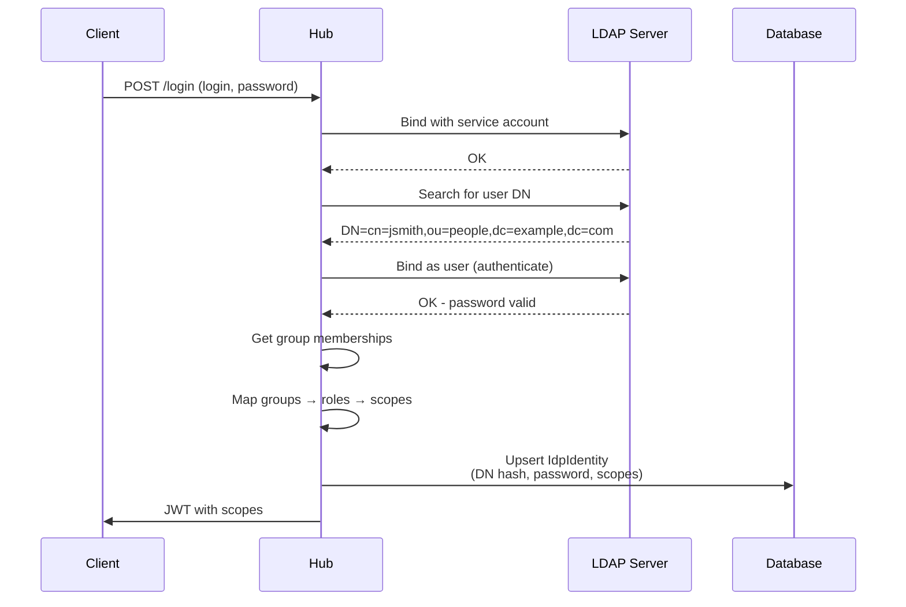

### Configuration

To enable federation to an external LDAP or Active Directory server, create an `LdapProvider` Custom Resource:

```yaml
apiVersion: v1
kind: Secret
metadata:
  name: ldap-service-account
  namespace: konveyor-tackle
type: Opaque
stringData:
  password: "<service-account-password>"

---
apiVersion: tackle.konveyor.io/v1alpha1
kind: LdapProvider
metadata:
  name: corporate-ldap
  namespace: konveyor-tackle
spec:
  name: "Corporate LDAP"
  kind: "ActiveDirectory"
  url: "ldaps://ldap.example.com:636"
  baseDN: "dc=example,dc=com"
  bindDN: "cn=service,dc=example,dc=com"
  password:
    name: ldap-service-account
    namespace: konveyor-tackle
  userFilter: "(sAMAccountName=%s)"
  groupFilter: "(&(objectClass=group)(member=%s))"
  hasMemberOf: true
  roleMappings:
    - and:
        - "CN=Developers,OU=Groups,DC=example,DC=com"
      roles:
        - architect
    - any:
        - "*Admins*"
      roles:
        - tackle-admin
```

**Note:** This configures an external LDAP/AD server for federated authentication. LDAP users are stored as `IdpIdentity` records, not local hub users.

| CRD Field | Purpose | Default (AD) | Default (LDAP) |
|-----------|---------|--------------|----------------|
| **kind** | Server type ("ACTIVEDIRECTORY", "AD", or blank) | - | - |
| **url** | External LDAP server URL | - | - |
| **baseDN** | Base DN for LDAP searches | - | - |
| **bindDN** | Service account bind DN | - | - |
| **password** | Reference to Secret containing service account password | - | - |
| **userFilter** | User search filter | `(sAMAccountName=%s)` | `(uid=%s)` |
| **groupFilter** | Group search filter | `(&(objectClass=group)(member=%s))` | `(&(objectClass=*)(member=%s))` |
| **hasMemberOf** | Use memberOf attribute for group membership | - | - |
| **roleMappings** | Map LDAP groups to hub roles | - | - |

### LDAP Login as Subject

LDAP users are identified by their login identifier (username), which is hashed for use as the subject:

**Example:**
```
Login from LDAP: jsmith
Subject hash:    HMAC-SHA256(jsmith) → dsLflKrXRBgaZC3u8XNHJS8UskJ19GM5AWIZ8nBheFA=
```

**Why hash the login?**
- Raw login identifier would expose usernames in JWT tokens
- HMAC with hub's secret passphrase ensures:
  - Opacity: Hash conceals actual login identifier
  - Stability: Login doesn't change when user moves OUs in LDAP
  - Uniqueness: Hub passphrase makes hash unique to this hub instance
- Same user always has same subject
- Database uniqueness constraint enforced

### Group Membership Strategies

**Option 1: memberOf attribute** (faster, if available):
1. Find user DN
2. Bind as user (authenticate)
3. Read `memberOf` attribute from user entry
4. Parse group DNs from attribute values

**Option 2: Group search** (universal):
1. Find user DN
2. Bind as user (authenticate)
3. Re-bind as service account
4. Search groups where `member=<user DN>`
5. Extract group names from results

**Which to use?**
- Active Directory: Usually has memberOf → set `hasMemberOf: true`
- OpenLDAP: May not have memberOf → set `hasMemberOf: false`

### Role Mapping

LDAP groups are mapped to hub roles using pattern-based rules with [doublestar pattern matching](https://github.com/bmatcuk/doublestar) (same as [redirect URI wildcards](#wildcard-patterns)).

```yaml
roleMappings:
  # AND rule - all patterns must match
  - and:
      - "CN=Developers,*"
      - "CN=Senior,*"
    roles:
      - architect
  
  # OR rule - any pattern must match
  - any:
      - "*Admin*"
      - "*Administrator*"
    roles:
      - tackle-admin
  
  # Combined AND + OR
  - and: ["CN=IT,*"]
    any: ["*PowerUser*", "*Developer*"]
    roles:
      - architect
```

**Rule semantics:**

| Rule Type | Behavior |
|-----------|----------|
| **and** | ALL patterns must match at least one group |
| **any** | At least ONE pattern must match a group |
| **roles** | Roles assigned when rule matches |

**Pattern Matching Syntax:**

LDAP group patterns use [doublestar glob matching](https://github.com/bmatcuk/doublestar), the same syntax as `.gitignore` files. Patterns are **case-sensitive** and match against the full LDAP group DN or name returned by your LDAP server.

**Wildcard operators:**

| Wildcard | Behavior | Example |
|----------|----------|---------|
| `*` | Matches any characters **within a segment** (doesn't cross `,` in DNs) | `*Admin*` matches `Global-Admin` or `AdminGroup` |
| `**` | Matches across **multiple segments** (crosses `,` separators) | `CN=IT,**/Admin` matches `CN=IT,OU=Security,CN=Admin` |
| `{a,b}` | Brace expansion - matches either `a` or `b` | `{*-admins,*-administrators}` matches both patterns |
| `?` | Matches exactly one character | `Admin?` matches `Admins` or `Admin1` |
| `[abc]` | Matches one character from the set | `Admin[123]` matches `Admin1`, `Admin2`, `Admin3` |

**Common LDAP Group Patterns:**

| Pattern | Description | Matches | Doesn't Match |
|---------|-------------|---------|---------------|
| `*Admins*` | Contains "Admins" anywhere | `CN=Global-Admins,OU=Groups`<br>`Security-Admins`<br>`CN=Admins-IT` | `CN=Admin,OU=Users` (no 's')<br>`CN=ADMINS` (case-sensitive) |
| `*-admins` | Ends with "-admins" | `platform-admins`<br>`security-admins`<br>`CN=it-admins,OU=Groups` | `admin-users`<br>`Admins-Group` |
| `CN=Developers,*` | Starts with "CN=Developers," | `CN=Developers,OU=Groups,DC=example,DC=com`<br>`CN=Developers,DC=example` | `CN=Senior,OU=Developers`<br>`OU=Developers,CN=Team` |
| `*Developer*` | Contains "Developer" | `CN=Developers,OU=IT`<br>`Senior-Developer`<br>`Developer-Team` | `CN=Develop,OU=Groups` |
| `CN=*,OU=Security,*` | Any CN in Security OU | `CN=Admins,OU=Security,DC=example,DC=com`<br>`CN=Team,OU=Security,DC=corp` | `CN=Admins,OU=IT,DC=example` |
| `{*-admins,*-admin}` | Ends with -admins OR -admin | `platform-admins`<br>`global-admin` | `admin-group` |

**Important behaviors:**

1. **Case-sensitive matching:**
   - `*Admin*` matches `Global-Admin` but NOT `global-admin`
   - `*ADMIN*` matches `IT-ADMIN` but NOT `It-Admin`

2. **Full string matching:**
   - Pattern must match the **entire** group name/DN returned by LDAP
   - Use `*` at start/end if you want partial matching

3. **Multiple rules accumulate:**
   - If a user's groups match multiple rules, they get **all roles** from all matching rules
   - Order doesn't matter - all rules are evaluated

**Example Scenarios:**

**Scenario 1: Simple suffix matching**
```yaml
roleMappings:
  - any: ["*-admins"]
    roles: ["tackle-admin"]
```
User groups: `["platform-admins", "security-team", "CN=it-admins,OU=Groups"]`  
Result: User gets `tackle-admin` role (2 groups match the pattern)

**Scenario 2: Multiple patterns (OR logic)**
```yaml
roleMappings:
  - any:
      - "*Developers*"
      - "*Engineers*"
    roles: ["architect"]
```
User groups: `["CN=Senior-Developers,OU=Groups", "QA-Team"]`  
Result: User gets `architect` role (first group matches `*Developers*`)

**Scenario 3: AND logic - all patterns must match**
```yaml
roleMappings:
  - and:
      - "*Migration*"
      - "konveyor-*"
    roles: ["migrator"]
```
User groups: `["konveyor-migration-team", "engineering-staff"]`  
Result: User gets `migrator` role (first group matches BOTH `*Migration*` AND `konveyor-*`)

**Scenario 4: Multiple roles from multiple rules**
```yaml
roleMappings:
  - any: ["*-admins"]
    roles: ["tackle-admin"]
  - any: ["*Architects*"]
    roles: ["architect"]
```
User groups: `["platform-admins", "Senior-Architects"]`  
Result: User gets BOTH `tackle-admin` AND `architect` roles

**Scenario 5: DN-based matching**
```yaml
roleMappings:
  - any:
      - "CN=Developers,OU=Engineering,*"
      - "CN=Architects,OU=Engineering,*"
    roles: ["architect"]
```
User groups: `["CN=Developers,OU=Engineering,DC=example,DC=com", "CN=Users,OU=IT"]`  
Result: User gets `architect` role (first group matches the DN pattern)

**Testing patterns:**

To verify your patterns work correctly:
1. Check your LDAP server's group format (simple names vs full DNs)
2. Test with `*pattern*` for contains, `pattern*` for starts-with, `*pattern` for ends-with
3. Remember patterns are case-sensitive - match the exact case from LDAP
4. Use multiple rules if you need complex OR conditions across different role types

**Reference:** See [doublestar documentation](https://pkg.go.dev/github.com/bmatcuk/doublestar/v4) for complete pattern syntax and matching behavior.

### Identity Lifecycle

**First Authentication:**
1. User provides username and password
2. Hub binds to LDAP with service account
3. Search for user by username → get DN
4. Bind as user with password (authenticates)
5. Fetch group memberships (memberOf or search)
6. Map groups to roles via RoleMapper
7. Resolve roles to permission scopes
8. **Create IdpIdentity**:
   - Kind = "ldap"
   - Subject = HMAC-SHA256(login)
   - Login = login
   - RefreshToken = password (encrypted)
   - Scopes = resolved scopes (from role mapping)
   - Expiration = now + lifespan (from caller)
9. Cache notified
10. Subject created from IdpIdentity
11. JWT issued with scopes

**Expiration and Staleness:**

The `Expiration` field controls how long the cached LDAP identity is trusted before re-authentication:

| Flow | Lifespan Setting | Environment Variable | Default | Purpose |
|------|-----------------|---------------------|---------|---------|
| **Basic Auth (LDAP)** | `Settings.Auth.LdapAuthLifespan` | `LDAP_AUTH_LIFESPAN` | 5 min | Balance between LDAP load and permission freshness |
| **Token Refresh (LDAP)** | `Settings.Auth.LdapAuthLifespan` | `LDAP_AUTH_LIFESPAN` | 5 min | Automatic group membership updates during refresh |
| **OIDC Login (LDAP)** | `Settings.Auth.LdapAuthLifespan` | `LDAP_AUTH_LIFESPAN` | 5 min | Consistent with other LDAP flows |

When identity is found in cache:
- If `Expiration > now`: Use cached scopes (no LDAP contact)
- If expired: Re-authenticate with LDAP, update identity

**Subsequent Authentications:**
1. Check cached IdpIdentity expiration
2. If expired:
   - Same LDAP authentication process
   - Group memberships may have changed
   - Roles/scopes recalculated
   - **IdpIdentity updated** (upsert by subject) with new expiration
3. If not expired: Reuse cached scopes
4. JWT issued with current scopes

**Token Refresh:**
1. Client requests token refresh
2. Hub finds IdpIdentity by subject
3. Check expiration:
   - If expired: **Re-authenticate with LDAP** using stored password, fetch fresh groups
   - If not expired: Reuse cached scopes
4. Issue new access token with current scopes

**Why re-authenticate on refresh?**
- Group memberships may change between token refreshes
- Ensures current permissions without user interaction
- Expiration controls staleness vs LDAP load tradeoff
- Alternative: force re-login on group changes

### Password Storage

LDAP passwords are stored encrypted in the `RefreshToken` field:

| Aspect | Detail |
|--------|--------|
| **Field** | IdpIdentity.RefreshToken |
| **Encryption** | Automatic ORM-level encryption (AES) |
| **Usage** | Re-authentication during token refresh |
| **Security** | Never exposed in API, encrypted at rest |

**Design rationale:**
- Token refresh requires fetching current group memberships
- LDAP server is source of truth for groups
- Re-authentication with stored password enables automatic updates
- Acceptable security trade-off with encryption

### Active Directory vs OpenLDAP

Differences in default configuration:

| Aspect | Active Directory | OpenLDAP |
|--------|------------------|----------|
| **Username attribute** | `sAMAccountName` | `uid` |
| **Group objectClass** | `group` | Generic (`*`) |
| **memberOf support** | Usually present | May not be present |
| **Recommended userFilter** | `(sAMAccountName=%s)` | `(uid=%s)` |
| **Recommended groupFilter** | `(&(objectClass=group)(member=%s))` | `(&(objectClass=*)(member=%s))` |

### Security

**Connection Security:**
- Use `ldaps://` (LDAP over TLS) for encrypted communication
- Validate server certificates in production
- Service account should have minimal privileges (read-only)

**Credential Security:**
- User passwords encrypted at rest
- Passwords transmitted over TLS to LDAP
- Passwords never in JWT tokens
- Passwords never exposed via API

**Authorization:**
- Groups mapped to roles
- Roles resolved to fine-grained scopes
- Scopes embedded in JWT access token
- Group membership refreshed on token refresh

---

## Storage Architecture

The authentication system uses a **hybrid storage model** with in-memory state for transient data and database persistence for durable data.

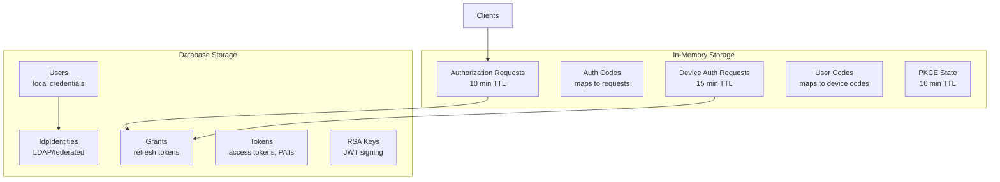

### In-Memory Storage

Transient authorization state is stored in memory for performance:

| Data Type | Lifetime | Purpose | Hub Restart Impact |
|-----------|----------|---------|-------------------|
| **Authorization Requests** | 10 minutes | OAuth auth code flow state | All pending flows fail |
| **Device Auth Requests** | 15 minutes | Device code verification state | All pending device flows fail |
| **PKCE State** | 10 minutes | Code verifier for device verification | Verification sessions lost |

**Design rationale:**
- Short-lived state (seconds to minutes)
- High-frequency access during flows
- No need for persistence (user can retry)
- Automatic memory cleanup via expiration

### Database Storage

Long-lived authentication artifacts are persisted:

| Table | Contents | Lifetime | Purpose |
|-------|----------|----------|---------|
| **Users** | Local user credentials, roles | Indefinite | Hub-managed authentication |
| **IdpIdentities** | LDAP/federated user mappings | Until user deleted | External authentication |
| **IdpClients** | OAuth2 client credentials, scopes | Until client deleted | Client credentials grant |
| **Grants** | Refresh tokens (hashed) | 30 days (default) | Token refresh |
| **Tokens** | Access tokens, PATs, task keys | Varies by type | API authentication |
| **RsaKeys** | JWT signing keys | Until rotated | Token signing |

**Design rationale:**
- Long-lived data (hours to days to indefinite)
- Must survive hub restarts
- Audit trail for tokens
- Enables token revocation

### Cache Architecture

In-memory cache reduces database load:

| Cached Data | Index | Refresh Strategy |
|-------------|-------|------------------|
| **Users** | By subject, by login | Always on lookup (security) |
| **IdpIdentities** | By subject | Item expiration + cache lifespan |
| **IdpClients** | By subject, by ID | Standard lifespan |
| **Roles** | By ID, by name | Standard lifespan |
| **Tokens (PATs)** | By digest | Standard lifespan |

**Cache lifespan:** Configurable via `AUTH_CACHE_LIFESPAN` (default 5 min)

**Cache invalidation:**
- Auto-refresh when data not found
- Auto-refresh when lifespan exceeded
- Explicit notification on data changes (UserSaved, IdentitySaved, ClientSaved, etc.)

**Why always refresh Users?**
- Password changes must take effect immediately
- Role changes must apply on next authentication
- Security-critical data requires fresh reads

**Why item expiration for IdpIdentities?**
- LDAP identities have individual `Expiration` timestamps
- Expiration based on authentication flow (Basic Auth vs Token Refresh)
- Allows different staleness for different use cases
- Cache lifespan is safety net for notification failures

---

## Token Types

The hub issues several types of tokens for different use cases:

### JWT Access Tokens

Short-lived tokens for API authentication:

| Attribute | Value |
|-----------|-------|
| **Format** | JSON Web Token (JWT) |
| **Signing** | RSA256 with hub private key |
| **Lifetime** | 5 minutes (default, configurable via `OIDC_TOKEN_LIFESPAN`) |
| **Claims** | `sub`, `scope`, `exp`, `iss`, `aud` |
| **Usage** | Bearer token in `Authorization` header |

**Standard claims:**
- `sub`: Subject identifier (UUID for User, hash/external for IdpIdentity)
- `scope`: Space-separated permission scopes
- `exp`: Expiration timestamp
- `iss`: Issuer URL (hub OIDC provider)
- `aud`: Audience (client ID)

### Refresh Tokens

Long-lived opaque tokens for obtaining new access tokens:

| Attribute | Value |
|-----------|-------|
| **Format** | Opaque string (random) |
| **Storage** | SHA256 hash in database |
| **Lifetime** | 30 days (default, configurable) |
| **Rotation** | Optional (new refresh token on use) |
| **Revocation** | Delete from database |

**Security:**
- Stored as hash (prevents token leak from DB compromise)
- Bound to specific grant (client + user)
- Can be revoked independently of access tokens

### Personal Access Tokens (PATs)

User-created API keys for automation:

| Attribute | Value |
|-----------|-------|
| **Format** | Opaque string (random) |
| **Storage** | SHA256 hash in database |
| **Lifetime** | Configurable (default 24 hours, max set by admin) |
| **Scopes** | Inherits creating user's permissions |
| **Management** | CRUD via `/auth/token` endpoints |
| **Revocation** | `/auth/token/{id}/revoke` endpoint removes token and associated grant |

**Use cases:**
- CLI scripting
- CI/CD pipelines
- Integration testing
- Automation tools

**Revocation:**
- Tokens can be revoked via the `/auth/token/{id}/revoke` endpoint
- Revocation removes both the token record and any associated OAuth grant
- More thorough cleanup than simple deletion

### Task API Keys

Automatically generated tokens for addon execution:

| Attribute | Value |
|-----------|-------|
| **Format** | Opaque string (random) |
| **Lifetime** | Tied to task execution |
| **Scopes** | Task-specific permissions (restricted) |
| **Cleanup** | Automatic on task completion |

**Scope restrictions:**
- Read-only for most resources
- Write access to task-specific endpoints
- No admin capabilities
- Defined in `AddonScopes` constant

---

## Key Management

The hub uses RSA key pairs for JWT signing.

### RSA Key Generation

**On first startup:**
1. Generate 2048-bit RSA key pair
2. Encode private key as PKCS#1 PEM
3. Encrypt private key using hub encryption key
4. Store in database `RsaKey` table
5. Assign sequential key ID

**Key structure:**

| Field | Purpose |
|-------|---------|
| **ID** | Key identifier (kid in JWT header) |
| **PEM** | Encrypted private key (PKCS#1 PEM format) |
| **CreateTime** | Key generation timestamp |

### JWKS Endpoint

Public keys published at `/.well-known/jwks.json`:

**Response format:**
```json
{
  "keys": [
    {
      "kty": "RSA",
      "use": "sig",
      "kid": "1",
      "n": "<modulus>",
      "e": "AQAB"
    }
  ]
}
```

**Usage:**
- Clients verify JWT signatures using public keys
- Standard OIDC discovery mechanism
- Supports key rotation (multiple keys in set)

### Key Rotation

**Current implementation:**
- Manual rotation (admin generates new key)
- Old keys retained for verification of existing tokens
- Future enhancement: automatic rotation on schedule

**Rotation process:**
1. Generate new RSA key
2. Add to database with new ID
3. New tokens signed with new key
4. Old keys still published in JWKS
5. Old keys eventually deleted after all tokens expire

---

## Session Management

### Device Verification Sessions

The device authorization flow uses **cookie-based sessions** for user authentication.

**Why sessions for device verification?**
- Verification page requires authenticated user
- Standard OAuth flow not applicable (no client context)
- Hub acts as OIDC Relying Party to itself
- Session isolates verification from OAuth flows

### Cookie Security

Session cookies use multiple layers of security:

| Security Feature | Implementation |
|------------------|----------------|
| **Encryption** | AES-GCM encryption of cookie value |
| **Authentication** | HMAC signature to prevent tampering |
| **HTTP-only** | Not accessible via JavaScript (XSS protection) |
| **SameSite** | Lax mode (CSRF protection) |
| **Secure flag** | HTTPS only (production) |

### Key Derivation

Cookie encryption keys are derived from the hub's API key secret:

```
Hash Key (HMAC):      SHA256(secret + "-hash")
Encryption Key (AES): SHA256(secret + "-encrypt")
```

**Benefits:**
- No additional configuration needed
- Consistent keys across hub instances
- Keys rotate when hub secret changes
- Cryptographically strong derivation

### Session Contents

Session cookie stores only the OIDC subject:

**Cookie name:** `oidc_subject`  
**Cookie value:** Authenticated user's subject identifier (encrypted)

**Usage:**
1. User authenticates via hub OIDC flow
2. Subject stored in encrypted session cookie
3. Verification page reads cookie to get subject
4. Device authorization updated with subject
5. Session cookie cleared after verification

### Session Lifetime

- **Lifetime:** Duration of OIDC callback flow (minutes)
- **Persistence:** Not persisted to database
- **Hub restart impact:** All verification sessions lost (acceptable - user can re-authenticate)

---

## Web UI Pages

All authentication pages use consistent, modern styling for a cohesive user experience.

### Login Page (`/oidc/login`)

**Purpose:** Authenticate users for OAuth authorization flows

**Features:**
- Username and password fields
- Optional "Sign in with [IdP]" button (when federation enabled)
- Mobile responsive design
- Form validation

### Device Authorization Page (`/oidc/device`)

**Purpose:** Verify device authorization requests via user code entry

**Features:**
- User code input (8 characters, `XXXX-XXXX` format)
- Monospace input with auto-uppercase
- Automatic redirect to login if not authenticated
- Code validation and completion

### Authorization Success Page

**Purpose:** Confirm successful device authorization

**Features:**
- Checkmark icon
- "Authorization Complete" message
- Instructions to return to device
- No user interaction required

### Design System

All pages share a consistent design:

| Element | Style |
|---------|-------|
| **Background** | Purple gradient (`#667eea` to `#764ba2`) |
| **Container** | White card with shadow and rounded corners |
| **Typography** | System font stack, h1=20px, body=13px |
| **Inputs** | 2px border, rounded corners, focus color `#667eea` |
| **Buttons** | Gradient background, hover animations (transform, shadow) |
| **Layout** | Centered, max-width 400px, responsive padding |

**Accessibility:**
- Semantic HTML
- Proper label associations
- Focus indicators
- Keyboard navigation

---

## API Client Integration

### Bearer Authentication

The `shared/binding/auth` package provides a Bearer authenticator for API clients:

**Features:**
- Device authorization flow
- Automatic token refresh
- Token storage and reuse
- Bearer header injection

**Example usage:**
```bash
# Using hub binding library
bearer := auth.NewBearer(issuerURL, "cli")
bearer.DeviceLogin(context.Background())

# Bearer automatically includes token in requests
client := binding.New(hubURL)
client.Client.Use(bearer)
applications, err := client.Application.List()
```

### CLI Tools

**Example CLI authentication flows:**

| Flow | Command Example | Use Case |
|------|-----------------|----------|
| **Device flow** | `./login -r https://tackle.example.com` | Interactive login |
| **Basic auth** | `./login -login admin -password pass` | Local users |
| **Bearer token** | `./login -b <token>` | Reuse existing token |
| **PAT** | Create via API after device login | Scripting, CI/CD |

**Hub URL variations:**
```bash
# Route deployment (OpenShift/Kubernetes)
./login -r https://tackle.example.com

# Direct hub access
./login -u http://localhost:8080

# Override issuer (rare)
./login -u http://localhost:8080 -i http://localhost:8080/oidc
```

---

## Client Configuration

### Overview

OIDC clients (web applications, CLI tools, IDE extensions) are configured using **IdpClient CRDs** instead of embedded YAML files. This provides:

- **Runtime configurability** - Add/modify clients without code changes
- **Kubernetes-native management** - Use kubectl/operators to manage clients
- **Secret management** - Reference Kubernetes Secrets for client credentials
- **Consistent with IdP/LDAP** - Same CRD pattern as IdentityProvider and LdapProvider

### IdpClient CRD Structure

```yaml
apiVersion: tackle.konveyor.io/v1alpha1
kind: IdpClient
metadata:
  name: web-ui
  namespace: konveyor-tackle
spec:
  # Database ID (required, must be 1-999 for seeded clients)
  id: 1
  
  # OAuth2 client identifier
  clientId: web-ui
  
  # Optional reference to Kubernetes Secret containing client credentials
  clientSecret:
    kind: Secret
    name: web-ui-secret
    namespace: konveyor-tackle
  
  # Application type: "web" or "native"
  applicationType: web
  
  # OAuth2 grant types
  grants:
  - authorization_code
  - refresh_token
  
  # Redirect URIs for OAuth flows
  redirectURIs:
  - https://tackle-konveyor-tackle.apps.example.com
  
  # OAuth2 scopes
  scopes:
  - openid
  - profile
  - email
```

### Field Reference

| Field | Required | Type | Description |
|-------|----------|------|-------------|
| `id` | Yes | integer (1-999) | Database ID for the client. Must be < 1000 for seeded clients. |
| `clientId` | Yes | string | OAuth2 client identifier (e.g., "web-ui", "kantra") |
| `clientSecret` | No | ObjectReference | Reference to Kubernetes Secret. Omit for public clients. |
| `applicationType` | Yes | string | OAuth2 application type: "web" or "native" |
| `grants` | Yes | []string | Supported OAuth2 grant types |
| `redirectURIs` | No | []string | Redirect URIs for authorization code flow |
| `scopes` | Yes | []string | OAuth2 scopes requested by this client |

### Client Types

#### Confidential Clients (Web Applications)

Web applications use client secrets for authentication:

```yaml
apiVersion: v1
kind: Secret
metadata:
  name: web-ui-secret
  namespace: konveyor-tackle
type: Opaque
stringData:
  clientSecret: "your-secret-here"
---
apiVersion: tackle.konveyor.io/v1alpha1
kind: IdpClient
metadata:
  name: web-ui
  namespace: konveyor-tackle
spec:
  id: 1
  clientId: web-ui
  clientSecret:
    kind: Secret
    name: web-ui-secret
    namespace: konveyor-tackle
  applicationType: web
  grants:
  - authorization_code
  - refresh_token
  redirectURIs:
  - https://tackle-konveyor-tackle.apps.example.com
  scopes:
  - openid
  - profile
  - email
```

**Secret format:**
- The referenced Secret must contain a key named `clientSecret`
- The secret value will be resolved at startup and hashed using bcrypt before being stored in the database
- Secrets are stored as bcrypt hashes (not encrypted) - same approach as user passwords
- Client authentication validates the presented secret against the stored hash
- Changing the secret requires a hub restart to take effect

#### Public Clients (CLI Tools, Native Apps)

Public clients (CLI tools, IDE extensions) cannot securely store secrets:

```yaml
apiVersion: tackle.konveyor.io/v1alpha1
kind: IdpClient
metadata:
  name: kantra
  namespace: konveyor-tackle
spec:
  id: 2
  clientId: kantra
  # No clientSecret field - this is a public client
  applicationType: native
  grants:
  - urn:ietf:params:oauth:grant-type:device_code
  - refresh_token
  scopes:
  - openid
  - profile
  - email
```

**Public client characteristics:**
- Omit the `clientSecret` field entirely
- Use `applicationType: native`
- Typically use device code or authorization code with PKCE

### Supported Grant Types

| Grant Type | Use Case | Client Type |
|------------|----------|-------------|
| `authorization_code` | Browser-based flows | Web, Native |
| `refresh_token` | Token refresh | Web, Native |
| `urn:ietf:params:oauth:grant-type:device_code` | CLI device flow | Native |
| `urn:ietf:params:oauth:grant-type:jwt-bearer` | Service accounts | Web, Native |

### ID Reservation System

IdpClient uses the same two-tier ID system as the RBAC seeding:

| ID Range | Source | Managed By | Purpose |
|----------|--------|------------|---------|
| **1-999** | IdpClient CRDs | Seeding system | Predefined clients (web-ui, kantra, kai-ide) |
| **≥ 1000** | User-created | Hub users | Custom clients added via API |

**ID field validation:**
- **Required** - Every IdpClient CR must specify an `id`
- **Range** - Must be between 1-999 (enforced by CRD validation)
- **Unique** - Each client must have a unique ID
- **Stable** - Same client always gets same ID across restarts

**Benefits:**
- Deterministic client IDs (e.g., web-ui is always ID 1)
- Safe reconciliation without affecting user-created clients
- Foreign key stability for database references

### Loading and Reconciliation

#### Startup Loading

On hub startup, clients are loaded from IdpClient CRDs:

1. **Kubernetes lookup** - List all IdpClient CRs in the hub namespace
2. **Secret resolution** - Resolve `clientSecret` references from Kubernetes Secrets
3. **Cache population** - Load clients into in-memory cache
4. **Database reconciliation** - Sync CRD state with database

**Code location:** `internal/auth/settings/pkg.go:Federated.getClients()`

#### Database Reconciliation

The seeding system reconciles CRD state with the database:

1. **Match on clientId** - Existing clients matched by `clientId` natural key
2. **Preserve specified IDs** - If CRD specifies `id` and client doesn't exist, use that ID
3. **Update fields** - Update existing clients if spec changes
4. **Delete orphaned** - Remove clients with ID < 1000 not in CRD list
5. **Ignore user clients** - Never touch clients with ID ≥ 1000

**Code location:** `internal/auth/domain.go:seedClients()`

#### Reconciliation Example

**Before reconciliation (database state):**
- Client ID=1, clientId="web-ui", secret="old-secret"
- Client ID=500, clientId="removed-client"
- Client ID=1001, clientId="user-custom-client"

**IdpClient CRDs:**
- web-ui (id=1, new secret)
- kantra (id=2, new client)

**After reconciliation:**
- Client ID=1, clientId="web-ui", secret="new-secret" ← Updated
- Client ID=2, clientId="kantra" ← Created
- Client ID=500, clientId="removed-client" ← Deleted (orphaned)
- Client ID=1001, clientId="user-custom-client" ← Preserved (ID ≥ 1000)

### Example: Full Client Setup

**Step 1: Create Secret (if needed)**

```bash
kubectl create secret generic web-ui-secret \
  --from-literal=clientSecret="your-secret-here" \
  -n konveyor-tackle
```

**Step 2: Create IdpClient CR**

```yaml
apiVersion: tackle.konveyor.io/v1alpha1
kind: IdpClient
metadata:
  name: web-ui
  namespace: konveyor-tackle
spec:
  id: 1
  clientId: web-ui
  clientSecret:
    kind: Secret
    name: web-ui-secret
    namespace: konveyor-tackle
  applicationType: web
  grants:
  - authorization_code
  - refresh_token
  redirectURIs:
  - https://tackle-konveyor-tackle.apps.example.com
  scopes:
  - offline_access
  - openid
  - profile
  - email
```

**Step 3: Apply and restart**

```bash
kubectl apply -f client.yaml
# Restart hub to load new client
kubectl rollout restart deployment/tackle-hub -n konveyor-tackle
```

### Default Clients

Tackle ships with three default clients:

#### 1. web-ui (ID=1)
- **Type:** Confidential web application
- **Grants:** authorization_code, refresh_token
- **Use:** Browser-based Tackle UI
- **Secret:** Required (referenced from Kubernetes Secret)

#### 2. kantra (ID=2)
- **Type:** Public native application
- **Grants:** device_code, refresh_token
- **Use:** Konveyor CLI tool
- **Secret:** None (public client)

#### 3. kai-ide (ID=3)
- **Type:** Public native application
- **Grants:** authorization_code, refresh_token
- **Use:** IDE extensions (VS Code, IntelliJ)
- **Secret:** None (public client)

### Redirect URI Templating and Wildcards

To support dynamic deployment environments (localhost, OpenShift routes, custom domains), redirect URIs can use **template variables** and **wildcard patterns** instead of hardcoded values.

#### Template Variables

Template variables are substituted with values from the incoming HTTP request's issuer URL:

| Variable | Substitution | Example Request | Result |
|----------|-------------|-----------------|--------|
| `${issuer}` | Full issuer URL | `https://hub.example.com:8080/oidc` | `https://hub.example.com:8080/oidc` |
| `${issuer.host}` | Host and port | `https://hub.example.com:8080/oidc` | `hub.example.com:8080` |
| `${issuer.port}` | Port only | `https://hub.example.com:8080/oidc` | `8080` |
| `${issuer.path}` | Path only | `https://hub.example.com:8080/oidc` | `/oidc` |

**Example template redirect URI:**
```yaml
redirectURIs:
  - "${issuer}/callback"                    # Becomes https://hub.example.com:8080/oidc/callback
  - "http://${issuer.host}/auth"            # Becomes http://hub.example.com:8080/auth
  - "http://localhost:${issuer.port}/done"  # Becomes http://localhost:8080/done
```

#### Wildcard Patterns

After template substitution, redirect URIs containing `*` wildcards are **matched against the requested redirect URI** using [doublestar pattern matching](https://github.com/bmatcuk/doublestar).

**Pattern matching semantics:**

Doublestar uses the same glob syntax as `.gitignore`, shell globs, and other path-matching tools. It treats `/` as a **path separator** and matches segment-by-segment:

| Wildcard | Behavior | Example Pattern | Matches | Doesn't Match |
|----------|----------|-----------------|---------|---------------|
| `*` | Matches any characters **except** `/` (within one path segment) | `https://*/callback` | `https://app.example.com/callback` | `https://app.example.com/auth/callback` |
| `**` | Matches zero or more **complete path segments** (crosses `/`) | `https://**/callback` | `https://app.example.com/auth/v1/callback` | `https://different.com/` |
| `{a,b}` | Brace expansion - matches either `a` or `b` | `https://host{,*}/**` | With/without port, with/without path | N/A |

**Important:** The pattern is split on `/` into segments, then matched segment-by-segment. This means:
- `https://host**` doesn't match `https://host:443/path` (`:443/path` crosses segment boundary)
- `https://host/**` does match (the `/**` is its own segment)
- `/**` at the end is **optional** - it can match zero path segments

**Common patterns:**

| Pattern | Description | Matches |
|---------|-------------|---------|
| `https://*.example.com/**` | Specific domain, any subdomain, any path | `https://app.example.com/callback`, `https://api.example.com/auth` |
| `http://localhost:*/**` | Localhost, any port, any path | `http://localhost:8080/callback`, `http://localhost:3000/` |
| `${issuer.proto}://${issuer.host}{,*}/**` | **Recommended for web-ui**: Same scheme and host as issuer, optional port, optional path | All port/path combinations |

**Example matching:** Pattern `https://hub.io{,*}/**` vs requested URIs:

| Requested URI | Match? | Explanation |
|---------------|--------|-------------|
| `https://hub.io` | ✅ Yes | `{,*}` matches empty, `/**` matches zero segments |
| `https://hub.io:443` | ✅ Yes | `{,*}` uses `*` alternative matching `:443`, `/**` matches zero segments |
| `https://hub.io/callback` | ✅ Yes | `{,*}` matches empty, `/**` matches `/callback` |
| `https://hub.io:443/hub/callback` | ✅ Yes | `{,*}` uses `*` matching `:443`, `/**` matches `/hub/callback` |
| `http://hub.io/callback` | ❌ No | Scheme mismatch (http vs https) |
| `https://other.io/callback` | ❌ No | Host mismatch |

**Reference:** See [doublestar documentation](https://pkg.go.dev/github.com/bmatcuk/doublestar/v4) for complete pattern syntax. The matching behavior is identical to `.gitignore` patterns and other glob-based tools.

#### Combined: Templates + Wildcards

Templates are substituted **first**, then wildcard matching is performed. This enables powerful dynamic patterns:

```yaml
redirectURIs:
  # OpenShift route pattern - matches any route in the cluster
  - "https://*.${issuer.host}/callback"
  
  # Localhost with any port
  - "http://localhost:*/callback"
  
  # Dynamic path matching
  - "${issuer.host}/*/callback"
```

**OpenShift/Kubernetes Example:**

For OpenShift routes following the pattern `<route-name>.<namespace>.apps.<cluster-domain>`:

```yaml
# Issuer: https://tackle-konveyor-tackle.apps.cluster1.example.com/oidc
redirectURIs:
  # Matches ANY route on the same cluster
  - "https://*.apps.cluster1.example.com"
  
  # Better: Use template to make it portable across clusters
  - "https://*.${issuer.host}"
  
  # This becomes: https://*.apps.cluster1.example.com
  # And matches: https://other-route.apps.cluster1.example.com
```

#### Processing Order

1. **Template substitution**: Replace `${issuer}`, `${issuer.host}`, `${issuer.port}`, `${issuer.path}`
2. **Wildcard matching**: If result contains `*`, match against requested redirect URI
3. **Result**:
   - If wildcard matches: Accept the **requested redirect URI**
   - If no wildcard or doesn't match: Use the **template-substituted value**
   - If no template or wildcard: Use the **original fixed URI**

#### Security Considerations

**Wildcards are matched against the requested redirect URI**, not the issuer. This means:
- ✅ Wildcards validate the redirect URI the client is requesting
- ✅ Pattern must match for the redirect to be accepted
- ✅ Prevents redirect to arbitrary domains
- ❌ Don't use overly broad patterns like `https://*` (matches any host)

**Best practices:**
- Use specific patterns: `https://*.example.com/*` instead of `https://*`
- Combine with templates for portability: `https://*.${issuer.host}`
- Test patterns thoroughly before production deployment
- Prefer fixed URIs when deployment URL is known and stable

### Troubleshooting

**Client not found:**
```
Error: client "web-ui" not found
```
**Fix:** Ensure IdpClient CR is created in the correct namespace and hub has restarted

**Secret resolution failed:**
```
Error: secret "web-ui-secret" not found
```
**Fix:** Create the referenced Secret in the same namespace as the IdpClient CR

**ID validation error:**
```
Error: spec.id: Invalid value: 1000: spec.id in body should be less than or equal to 999
```
**Fix:** Use ID between 1-999 for seeded clients. IDs ≥ 1000 are reserved for user-created clients.

**Duplicate clientId:**
```
Error: UNIQUE constraint failed: IdpClients.clientId
```
**Fix:** Each client must have a unique `clientId`. Check for duplicate CRs or existing database entries.

**Redirect URI mismatch:**
```
Error: redirect_uri does not match any registered URIs
```
**Fix:** Check that your wildcard patterns or template variables correctly match the requested redirect URI. Use template variables like `${issuer.host}` for portable configurations.

---

## RBAC Seeding System

### Overview

The RBAC system automatically maintains scopes, roles, and users at runtime by:

1. **Generating scopes** from registered API route resources
2. **Loading roles** from `roles.yaml` with scope references
3. **Loading users** from `users.yaml` with role references

**Trigger:** `Domain.Seed()` called after route registration completes

### Scope Generation

For each registered resource, 6 scope strings are generated:

**Input:** Resource `"applications"`

**Output:** 6 scopes
- `applications:decrypt`
- `applications:delete`
- `applications:get`
- `applications:patch`
- `applications:post`
- `applications:put`

**Scope structure:**
- `Resource`: Resource name (e.g., `applications`)
- `Method`: HTTP method (e.g., `get`)
- `String()`: Combined scope string (e.g., `applications:get`)

**HTTP verb mapping:**
- `get` → Read
- `post` → Create
- `put` / `patch` → Update
- `delete` → Delete
- `decrypt` → Decrypt encrypted resources

### Resource Registration

API handlers register their resources with the global `auth.Tenant` Domain:

```go
func init() {
    auth.Tenant.Register("applications")
    auth.Tenant.Register("tasks")
    // ...
}
```

**Tenant Domain:**
- `auth.Tenant` is a global Domain instance initialized at startup
- `Register(resource)` adds resources to the in-memory resource registry
- `Resources()` returns registered resources as `[]string`
- `Scopes()` returns all generated scope strings (computed, not stored in database)

### Role Definition Format

Roles defined in `internal/auth/seed/roles.yaml`:

```yaml
- id: 1
  role: admin
  resources:
    - name: applications
      verbs: [delete, get, post, put]
    - name: tasks
      verbs: [delete, get, post, put, patch]
```

**Wildcard Support:**

Roles can use wildcards for resources and verbs to grant broad permissions:

```yaml
- id: 1
  role: admin
  resources:
    # Grant all permissions on all resources
    - name: '*'
      verbs: ['*']
    # Grant all permissions on admin resource
    - name: admin
      verbs: ['*']
```

**Wildcard patterns:**
- `*:*` → All verbs on all resources (superuser)
- `applications:*` → All verbs on applications resource
- `*:get` → Get verb on all resources (read-only across all resources)

**Wildcard expansion:**
1. During role seeding, wildcards are expanded to concrete scope strings
2. `*` in resource → expands to all registered resources (from `auth.Tenant.Resources()`)
3. `*` in verb → expands to all HTTP verbs (`decrypt`, `delete`, `get`, `patch`, `post`, `put`)
4. Example: `*:get` expands to `applications:get`, `tasks:get`, `tags:get`, etc.

**Resolution:**
1. For each resource + verb → expand wildcards
2. For each expanded scope → validate against generated scopes
3. Example: `applications` + `get` → `applications:get` (validated against `auth.Tenant.Scopes()`)
4. Example: `*` + `*` → all scopes for all resources
5. Scopes stored as JSON array in role's `Scopes` field

### User Definition Format

Users defined in `internal/auth/seed/users.yaml`:

```yaml
- id: 1
  login: admin
  password: admin
  roles:
    - admin
```

**Resolution:**
1. For each role name → lookup role by name
2. Associate all resolved roles with user
3. Hash password using bcrypt
4. Generate UUID subject

### ID Preservation

Two-tier ID system ensures safety:

| ID Range | Source | Managed By | Deletable? |
|----------|--------|------------|------------|
| **< 1000** | YAML files | Seeding system | Yes (if removed from YAML) |
| **≥ 1001** | User-created | Hub users | No (never touched by seeding) |

**Benefits:**
- Seeding can safely update predefined resources
- User-created resources never affected
- ID stability across hub restarts
- Clear boundary between seeded and user data

### Reconciliation Logic

For each resource type (roles, users):

1. **Read** existing from database
2. **Read** desired from source (YAML)
3. **Diff** to find what to delete/update/create
4. **Delete** orphaned seeded resources (ID < 1000, not in desired)
5. **Update** existing seeded resources (ID < 1000, in both)
6. **Create** new seeded resources with static IDs
7. **Ignore** user-created resources (ID ≥ 1001)

**Transaction safety:**
- All changes in single database transaction
- Rollback on any error
- Atomic updates ensure consistency

### Scope Model

**No database persistence:**
- Scopes are computed in-memory from registered resources
- `auth.Tenant.Scopes()` returns all generated scope strings
- Role scopes stored as JSON array (`Scopes []string`) on Role model
- No separate Scope/Permission table

**API endpoint:**
- `/auth/scopes` returns computed scopes for UI dropdowns
- Read-only - scopes cannot be created/updated via API
- Scopes are automatically available when resources are registered

**Scope validation and pruning:**
- `Domain.HasScope(scope)` validates scope strings against registered scopes
- `Domain.pruneScopes()` removes unknown scopes from user-created roles (ID ≥ 1000)
- Runs during seeding after scope generation
- Logs removed scopes for visibility
- Ensures user-created roles don't reference obsolete/unregistered scopes
- Example: If a resource is removed, its scopes are pruned from custom roles

---

## Role Permissions

This section documents the permissions granted to each predefined role.

**Verb mapping (CRUD):**
- `get` → Read
- `post` → Create
- `put` / `patch` → Update
- `delete` → Delete

### 🛡 Role: admin

Full administrative access to **all resources and all operations** via wildcard scopes (`*:*`).

**Wildcard permissions:**
- Resource: `*` (all resources)
- Verbs: `*` (all operations)

This grants the admin role every permission in the system, including:

| Resource | Create | Read | Update | Delete |
|----------|--------|------|--------|--------|
| addons | ✅ | ✅ | ✅ | ✅ |
| adoptionplans | ✅ | ❌ | ❌ | ❌ |
| analyses | ✅ | ✅ | ✅ | ✅ |
| applications | ✅ | ✅ | ✅ | ✅ |
| applications.analyses | ✅ | ✅ | ✅ | ✅ |
| applications.assessments | ✅ | ✅ | ❌ | ❌ |
| applications.bucket | ✅ | ✅ | ✅ | ✅ |
| applications.facts | ✅ | ✅ | ✅ | ✅ |
| applications.manifests | ✅ | ✅ | ❌ | ❌ |
| applications.stakeholders | ❌ | ❌ | ✅ | ❌ |
| applications.tags | ✅ | ✅ | ✅ | ✅ |
| archetypes | ✅ | ✅ | ✅ | ✅ |
| archetypes.assessments | ✅ | ✅ | ❌ | ❌ |
| assessments | ✅ | ✅ | ✅ | ✅ |
| buckets | ✅ | ✅ | ✅ | ✅ |
| businessservices | ✅ | ✅ | ✅ | ✅ |
| cache | ❌ | ✅ | ❌ | ✅ |
| dependencies | ✅ | ✅ | ✅ | ✅ |
| files | ✅ | ✅ | ✅ | ✅ |
| generators | ✅ | ✅ | ✅ | ✅ |
| identities | ✅ | ✅ | ✅ | ✅ |
| imports | ✅ | ✅ | ✅ | ✅ |
| jobfunctions | ✅ | ✅ | ✅ | ✅ |
| kai | ✅ | ✅ | ❌ | ❌ |
| manifests | ✅ | ✅ | ✅ | ✅ |
| migrationwaves | ✅ | ✅ | ✅ | ✅ |
| platforms | ✅ | ✅ | ✅ | ✅ |
| proxies | ✅ | ✅ | ✅ | ✅ |
| questionnaires | ✅ | ✅ | ✅ | ✅ |
| reviews | ✅ | ✅ | ✅ | ✅ |
| rulesets | ✅ | ✅ | ✅ | ✅ |
| schemas | ✅ | ✅ | ✅ | ✅ |
| settings | ✅ | ✅ | ✅ | ✅ |
| stakeholdergroups | ✅ | ✅ | ✅ | ✅ |
| stakeholders | ✅ | ✅ | ✅ | ✅ |
| tagcategories | ✅ | ✅ | ✅ | ✅ |
| tags | ✅ | ✅ | ✅ | ✅ |
| targets | ✅ | ✅ | ✅ | ✅ |
| tasks | ✅ | ✅ | ✅ | ✅ |
| tasks.bucket | ✅ | ✅ | ✅ | ✅ |
| tickets | ✅ | ✅ | ✅ | ✅ |
| trackers | ✅ | ✅ | ✅ | ✅ |

### 🛠 Role: architect

Broad create/update/delete rights, restricted on sensitive resources (identities, proxies, settings, trackers).

| Resource | Create | Read | Update | Delete |
|----------|--------|------|--------|--------|
| addons | ✅ | ✅ | ✅ | ✅ |
| adoptionplans | ✅ | ❌ | ❌ | ❌ |
| analyses | ✅ | ✅ | ✅ | ✅ |
| applications | ✅ | ✅ | ✅ | ✅ |
| applications.analyses | ✅ | ✅ | ✅ | ✅ |
| applications.assessments | ✅ | ✅ | ❌ | ❌ |
| applications.bucket | ✅ | ✅ | ✅ | ✅ |
| applications.facts | ✅ | ✅ | ✅ | ✅ |
| applications.manifests | ✅ | ✅ | ❌ | ❌ |
| applications.stakeholders | ❌ | ❌ | ✅ | ❌ |
| applications.tags | ✅ | ✅ | ✅ | ✅ |
| archetypes | ✅ | ✅ | ✅ | ✅ |
| archetypes.assessments | ✅ | ✅ | ❌ | ❌ |
| assessments | ✅ | ✅ | ✅ | ✅ |
| buckets | ✅ | ✅ | ✅ | ✅ |
| businessservices | ✅ | ✅ | ✅ | ✅ |
| cache | ❌ | ✅ | ❌ | ❌ |
| dependencies | ✅ | ✅ | ✅ | ✅ |
| files | ✅ | ✅ | ✅ | ✅ |
| generators | ✅ | ✅ | ✅ | ✅ |
| identities | ❌ | ✅ | ❌ | ❌ |
| imports | ✅ | ✅ | ✅ | ✅ |
| jobfunctions | ✅ | ✅ | ✅ | ✅ |
| kai | ✅ | ✅ | ❌ | ❌ |
| manifests | ✅ | ✅ | ✅ | ✅ |
| migrationwaves | ✅ | ✅ | ✅ | ✅ |
| platforms | ✅ | ✅ | ✅ | ✅ |
| proxies | ❌ | ✅ | ❌ | ❌ |
| questionnaires | ❌ | ✅ | ❌ | ❌ |
| reviews | ✅ | ✅ | ✅ | ✅ |
| rulesets | ✅ | ✅ | ✅ | ✅ |
| schemas | ❌ | ✅ | ❌ | ❌ |
| settings | ❌ | ✅ | ❌ | ❌ |
| stakeholdergroups | ✅ | ✅ | ✅ | ✅ |
| stakeholders | ✅ | ✅ | ✅ | ✅ |
| tagcategories | ✅ | ✅ | ✅ | ✅ |
| tags | ✅ | ✅ | ✅ | ✅ |
| targets | ✅ | ✅ | ✅ | ✅ |
| tasks | ✅ | ✅ | ✅ | ✅ |
| tasks.bucket | ✅ | ✅ | ✅ | ✅ |
| tickets | ✅ | ✅ | ✅ | ✅ |
| trackers | ❌ | ✅ | ❌ | ❌ |

### 🚚 Role: migrator

Mostly read-only, except full management of dependencies and tasks.

| Resource | Create | Read | Update | Delete |
|----------|--------|------|--------|--------|
| addons | ❌ | ✅ | ❌ | ❌ |
| adoptionplans | ✅ | ❌ | ❌ | ❌ |
| analyses | ❌ | ✅ | ❌ | ❌ |
| applications | ❌ | ✅ | ❌ | ❌ |
| applications.analyses | ❌ | ✅ | ❌ | ❌ |
| applications.assessments | ❌ | ✅ | ❌ | ❌ |
| applications.bucket | ❌ | ✅ | ❌ | ❌ |
| applications.facts | ❌ | ✅ | ❌ | ❌ |
| applications.manifests | ❌ | ✅ | ❌ | ❌ |
| applications.tags | ❌ | ✅ | ❌ | ❌ |
| archetypes | ❌ | ✅ | ❌ | ❌ |
| archetypes.assessments | ❌ | ✅ | ❌ | ❌ |
| assessments | ❌ | ✅ | ❌ | ❌ |
| buckets | ❌ | ✅ | ❌ | ❌ |
| businessservices | ❌ | ✅ | ❌ | ❌ |
| cache | ❌ | ✅ | ❌ | ❌ |
| dependencies | ✅ | ✅ | ✅ | ✅ |
| files | ❌ | ✅ | ❌ | ❌ |
| generators | ❌ | ✅ | ❌ | ❌ |
| identities | ❌ | ✅ | ❌ | ❌ |
| imports | ❌ | ✅ | ❌ | ❌ |
| jobfunctions | ❌ | ✅ | ❌ | ❌ |
| kai | ✅ | ✅ | ❌ | ❌ |
| manifests | ❌ | ✅ | ❌ | ❌ |
| migrationwaves | ❌ | ✅ | ❌ | ❌ |
| platforms | ❌ | ✅ | ❌ | ❌ |
| proxies | ❌ | ✅ | ❌ | ❌ |
| questionnaires | ❌ | ✅ | ❌ | ❌ |
| reviews | ❌ | ✅ | ❌ | ❌ |
| rulesets | ❌ | ✅ | ❌ | ❌ |
| schemas | ❌ | ✅ | ❌ | ❌ |
| settings | ❌ | ✅ | ❌ | ❌ |
| stakeholdergroups | ❌ | ✅ | ❌ | ❌ |
| stakeholders | ❌ | ✅ | ❌ | ❌ |
| tagcategories | ❌ | ✅ | ❌ | ❌ |
| tags | ❌ | ✅ | ❌ | ❌ |
| targets | ❌ | ✅ | ❌ | ❌ |
| tasks | ✅ | ✅ | ✅ | ✅ |
| tasks.bucket | ✅ | ✅ | ✅ | ✅ |
| tickets | ❌ | ✅ | ❌ | ❌ |
| trackers | ❌ | ✅ | ❌ | ❌ |

### 📋 Role: project-manager

Read-only for most resources, can update application stakeholders and fully manage migration waves.

| Resource | Create | Read | Update | Delete |
|----------|--------|------|--------|--------|
| addons | ❌ | ✅ | ❌ | ❌ |
| adoptionplans | ✅ | ❌ | ❌ | ❌ |
| applications | ❌ | ✅ | ❌ | ❌ |
| applications.analyses | ❌ | ✅ | ❌ | ❌ |
| applications.assessments | ❌ | ✅ | ❌ | ❌ |
| applications.bucket | ❌ | ✅ | ❌ | ❌ |
| applications.facts | ❌ | ✅ | ❌ | ❌ |
| applications.manifests | ❌ | ✅ | ❌ | ❌ |
| applications.stakeholders | ❌ | ❌ | ✅ | ❌ |
| applications.tags | ❌ | ✅ | ❌ | ❌ |
| archetypes | ❌ | ✅ | ❌ | ❌ |
| archetypes.assessments | ❌ | ✅ | ❌ | ❌ |
| assessments | ❌ | ✅ | ❌ | ❌ |
| buckets | ❌ | ✅ | ❌ | ❌ |
| businessservices | ❌ | ✅ | ❌ | ❌ |
| cache | ❌ | ✅ | ❌ | ❌ |
| dependencies | ❌ | ✅ | ❌ | ❌ |
| generators | ❌ | ✅ | ❌ | ❌ |
| identities | ❌ | ✅ | ❌ | ❌ |
| imports | ❌ | ✅ | ❌ | ❌ |
| jobfunctions | ❌ | ✅ | ❌ | ❌ |
| kai | ✅ | ✅ | ❌ | ❌ |
| migrationwaves | ✅ | ✅ | ✅ | ✅ |
| platforms | ❌ | ✅ | ❌ | ❌ |
| proxies | ❌ | ✅ | ❌ | ❌ |
| questionnaires | ❌ | ✅ | ❌ | ❌ |
| reviews | ❌ | ✅ | ❌ | ❌ |
| rulesets | ❌ | ✅ | ❌ | ❌ |
| schemas | ❌ | ✅ | ❌ | ❌ |
| settings | ❌ | ✅ | ❌ | ❌ |
| stakeholdergroups | ❌ | ✅ | ❌ | ❌ |
| stakeholders | ❌ | ✅ | ❌ | ❌ |
| tagcategories | ❌ | ✅ | ❌ | ❌ |
| tags | ❌ | ✅ | ❌ | ❌ |
| targets | ❌ | ✅ | ❌ | ❌ |
| tasks | ❌ | ✅ | ❌ | ❌ |
| tasks.bucket | ❌ | ✅ | ❌ | ❌ |
| tickets | ❌ | ✅ | ❌ | ❌ |
| trackers | ❌ | ✅ | ❌ | ❌ |
